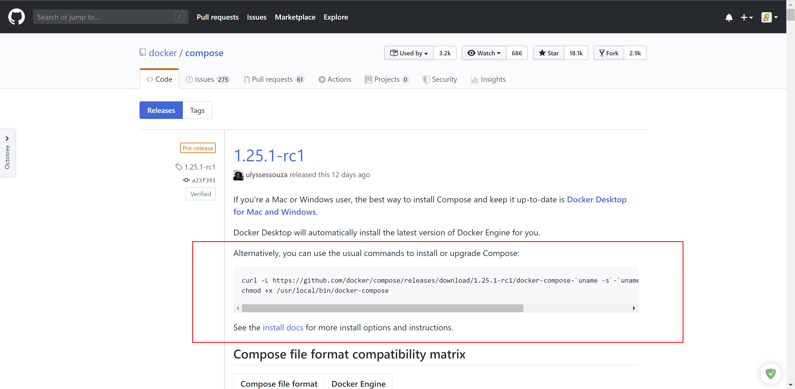
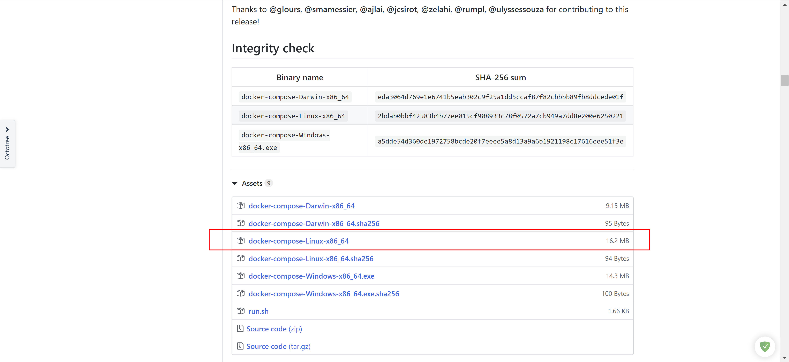

# Docker Compose说明

- [Docker Compose说明](#docker-compose说明)
  - [资料](#资料)
  - [概述](#概述)
  - [安装docker-compose](#安装docker-compose)
  - [升级](#升级)
  - [docker-compose命令](#docker-compose命令)
  - [docker-compose.yml 属性](#docker-composeyml-属性)
  - [一个 Spring Boot 项目的 docker-compose 文件](#一个-spring-boot-项目的-docker-compose-文件)
  - [docker-compose 常用命令](#docker-compose-常用命令)
  - [参考](#参考)

## 资料

官方文档：[Compose file reference](https://docs.docker.com/compose/compose-file/)

Github项目地址：[docker / compose](https://github.com/docker/compose)

## 概述

一句话描述：docker-compose 是用来做docker 的多容器控制。

> Define and run multi-container applications with Docker.

docker-compose 是一个用来把 docker 自动化的东西。有了 docker-compose ，你可以把所有繁复的 docker 操作全都一条命令，自动化的完成。

**为什么要用 docker-compose，它解决了什么？**

用通俗的语言来说，我们平时操作 docker 还是很原始的一系列动作，你手动使用 docker 的动作可以拆分成

- 找到一个系统镜像 // docker search
- 安装好 vm 或者 virtual box // apt-get install docker
- 在 vm 中安装镜像 // docker run -d -it 你的镜像
- 略..

这是最小的动作， 如果你要映射硬盘，设置nat网络或者桥接网络，等等…你就要做更多的 docker 操作， 这显然是非常没有效率的。

但是我们写在 docker-compose.yml 文件中，你只需要写好后运行即可：

```bash
docker-compose up -d
```

一切都是那么的简单。

## 安装docker-compose

首先，需要系统中已安装docker。

**方式一**：[官方-二级制文件安装](https://docs.docker.com/compose/install/)





安装 Docker Compose 可以通过下面命令自动下载适应版本的 Compose，并为安装脚本添加执行权限：

```bash
sudo curl -L "https://github.com/docker/compose/releases/download/1.26.2/docker-compose-$(uname -s)-$(uname -m)" -o /usr/local/bin/docker-compose
chmod +x /usr/local/bin/docker-compose
```

国内加速

```bash
sudo curl -L "https://get.daocloud.io/docker/compose/releases/download/1.26.2/docker-compose-$(uname -s)-$(uname -m)" -o /usr/local/bin/docker-compose
chmod +x /usr/local/bin/docker-compose
```

查看是否安装成功：

```bash
docker-compose -v
```

注：

- 网络不好的时候可以在github中手动下载文件`docker-compose-Linux-x86_64`，再将文件名修改为`docker-compose`，上传至`/usr/local/bin`目录
- 如果上传至`/usr/local/bin`无法快捷访问，可以放到`/usr/bin`

**方式二**：[pip安装](https://github.com/NaturalHistoryMuseum/scratchpads2/wiki/Install-Docker-and-Docker-Compose-(Centos-7))

Install Extra Packages for Enterprise Linux

```bash
sudo yum install epel-release
```

Install python-pip

```bash
sudo yum install -y python-pip
```

Then install Docker Compose:

```bash
sudo pip install docker-compose
```

You will also need to upgrade your Python packages on CentOS 7 to get docker-compose to run successfully:

```bash
sudo yum upgrade python*
```

To verify a successful Docker Compose installation, run:

```bash
docker-compose version
```

windows系统则可以使用官方GitHub仓库中发布的安装文件进行安装。

## 升级

删除后重装即可

```bash
# 方式一
sudo rm /usr/local/bin/docker-compose

# 方式二
sudo pip uninstall docker-compose
```

## docker-compose命令

**Usage**:

```bash
docker-compose [-f=<arg>...] [options] [COMMAND] [ARGS...]
docker-compose -h|--help
```

**Options**:

```bash
  -f, --file FILE             Specify an alternate compose file (default: docker-compose.yml)
  -p, --project-name NAME     Specify an alternate project name (default: directory name)
  --verbose                   Show more output
  -v, --version               Print version and exit
  -H, --host HOST             Daemon socket to connect to

  --tls                       Use TLS; implied by --tlsverify
  --tlscacert CA_PATH         Trust certs signed only by this CA
  --tlscert CLIENT_CERT_PATH  Path to TLS certificate file
  --tlskey TLS_KEY_PATH       Path to TLS key file
  --tlsverify                 Use TLS and verify the remote
  --skip-hostname-check       Don't check the daemon's hostname against the name specified
                              in the client certificate (for example if your docker host
                              is an IP address)
```

**Commands**:

```bash
- build              Build or rebuild services
- bundle             Generate a Docker bundle from the Compose file
- config             Validate and view the compose file
- create             Create services
- down               Stop and remove containers, networks, images, and volumes
- events             Receive real time events from containers
- exec               Execute a command in a running container
- help               Get help on a command
- kill               Kill containers
- logs               View output from containers
- pause              Pause services
- port               Print the public port for a port binding
- ps                 List containers
- pull               Pull service images
- push               Push service images
- restart            Restart services
- rm                 Remove stopped containers
- run                Run a one-off command
- scale              Set number of containers for a service
- start              Start services
- stop               Stop services
- top                Display the running processes
- unpause            Unpause services
- up                 Create and start containers
- version            Show the Docker-Compose version information
```

-f ：指定docker-compose.yml文件，默认是docker-compose.yml，当一条命令有多个-f参数时，会做替换操作
-p ：指定docker-compose的项目目录，也就是docker-compose.yml文件的存储目录

**命令详细说明**：

**build**:

```console
Usage: build [options] [SERVICE...]

Options:
    --force-rm  Always remove intermediate containers.
    --no-cache  Do not use cache when building the image.
    --pull      Always attempt to pull a newer version of the image.
```

当修改dockerfile或者docker-compose时，运行docker-compose build 重建镜像。  生成镜像后，可使用docker-compose up启动。

---

**config**:

```console
Usage: config [options]

Options:
    -q, --quiet     只验证配置，不输出。 当配置正确时，不输出任何内容，当文件配置错误，输出错误信息。
    --services      打印服务名，一行一个
```

验证和查看compose文件配置。

---

**create**:

```console
Usage: create [options] [SERVICE...]

Options:
    --force-recreate       重新创建容器，即使他的配置和镜像没有改变，不兼容--no-recreate参数
    --no-recreate          如果容器已经存在，不需要重新创建. 不兼容--force-recreate参数
    --no-build             不创建镜像，即使缺失
    --build                创建容器前，生成镜像
```

为服务创建容器。只是单纯的create，还需要使用start启动compose。

---

**down**:

```console
Usage: down [options]

Options:
    --rmi type          删除镜像，类型必须是:
                        'all': 删除compose文件中定义的所以镜像.
                        'local': 删除镜像名为空的镜像
    -v, --volumes       删除卷
                        attached to containers.
    --remove-orphans    Remove containers for services not defined in the
                        Compose file
```

停止和删除容器、网络、卷、镜像，这些内容是通过docker-compose up命令创建的。默认值删除容器网络，可以通过指定 rmi volumes参数删除镜像和卷。

---

**events**:

```console
Usage: events [options] [SERVICE...]

Options:
    --json      输出事件日志，json格式
```

输出docker-compose 事件的日志，当执行docker-compose命令操作时，docker-compose even命令就会监控日志:

```json
{
    "service": "web",
    "event": "create",
    "container": "213cf75fc39a",
    "image": "alpine:edge",
    "time": "2015-11-20T18:01:03.615550",
}
```

---

**exec**:

```console
Usage: exec [options] SERVICE COMMAND [ARGS...]

Options:
    -d                分离模式，后台运行命令.
    --privileged      获取特权.
    --user USER       指定运行的用户.
    -T                禁用分配TTY. By default `docker-compose exec`
                      分配 a TTY.
    --index=index     当一个服务拥有多个容器时，可通过该参数登陆到该服务下的任何服务，例如：docker-compose exec --index=1 web /bin/bash ，web服务中包含多个容器
                      instances of a service [default: 1]
```

和docker exec命令功能相同，可以通过service name登陆到容器中

e.g. docker-compose exec web sh

---

**kill**:

```console
Usage: kill [options] [SERVICE...]

Options:
    -s SIGNAL         向容器发送信号. 默认是SIGKILL
```

通过发送 SIGKILL 信号来强制停止服务容器。支持通过参数来指定发送的信号:

```bash
docker-compose kill -s SIGINT
```

---

**logs**:

```console
Usage: logs [options] [SERVICE...]

Options:
    --no-color          单色输出，不显示其他颜.
    -f, --follow        跟踪日志输出，就是可以实时查看日志
    -t, --timestamps    显示时间戳
    --tail              从日志的结尾显示，--tail=200
```

显示日志输出。

---

**pause**:

```console
Usage: pause [SERVICE...]
```

暂停容器服务. docker-compose pause 暂停所有服务. docker-compose pause web，之后暂停web服务的容器。

---

**unpause**:

```console
Usage: unpause [SERVICE...]
```

恢复容器服务. docker-compose unpause 恢复所有服务. docker-compose unpause web，之后恢复web服务的容器。

---

**port**:

```console
Usage: port [options] SERVICE PRIVATE_PORT

Options:
    --protocol=proto  tcp or udp [default: tcp]
    --index=index     index of the container if there are multiple
```

输出服务的共有端口。

```bash
docker-compose port web 8080  # 8080为容器内部端口

- "80:80" # 绑定容器的80端口到主机的80端口
- "9000:8080" # 绑定容器的8080端口到主机的9000端口
- "443" # 绑定容器的443端口到主机的任意端口，容器启动时随机分配绑定的主机端口号
```

---

**ps**:

```console
Usage: ps [options] [SERVICE...]

Options:
    -q    只显示ID
```

显示容器. 默认显示name、command、state、ports

---

**pull**:

```console
Usage: pull [options] [SERVICE...]

Options:
    --ignore-pull-failures  忽略pull失败的镜像，继续pull其他镜像.
```

pull compose文件中所指明的镜像。

---

**push**:

```console
Usage: push [options] [SERVICE...]

Options:
    --ignore-push-failures  忽略错误
```

push compose文件中所指明的镜像。

---

**restart**:

```console
Usage: restart [options] [SERVICE...]

Options:
-t, --timeout TIMEOUT      Specify a shutdown timeout in seconds. (default: 10)
```

重启容器服务。

---

**rm**:

```console
Usage: rm [options] [SERVICE...]

Options:
    -f, --force   Don't ask to confirm removal
    -v            期初加载到容器的任何匿名卷
    -a, --all     Also remove one-off containers created by `docker-compose run`
```

删除已停止的容器（Removes stopped service containers），如果服务在运行，需要先docker-compose stop 停止容器。

---

**run**:

```console
Usage: run [options] [-e KEY=VAL...] SERVICE [COMMAND] [ARGS...]

Options:
    -d                   后台运行，输出容器名.
    -e KEY=VAL            设置环境变量参数，可以使用多次
    -u, --user=""         指定运行的用户
    --no-deps             不启动link服务，只启动run的服务.
    --rm                  运行后删除容器，后台运行模式除外(-d).
    -p, --publish=[]      开放端口
    --service-ports       compose文件中配置什么端口，就映射什么端口.
    -T                    禁用TTY.
    -w, --workdir=""      设置工作目录
```

启动web服务器，并执行bash命令：`docker-compose run web bash`

根据compose配置文件制定的端口，映射到主机：`docker-compose run --service-ports web python manage.py shell`

指定端口映射到主机：`docker-compose run --publish 8080:80 -p 2022:22 -p 127.0.0.1:2021:21 web python manage.py shell`

link db容器：`docker-compose run db psql -h db -U docker`

不link容器，单独启动指定容器:`docker-compose run --no-deps web python manage.py shell`

---

**scale**:

```console
Usage: scale [SERVICE=NUM...]
```

设置服务的个数，例：`docker-compose scale web=2 worker=3`

---

**start**:

```console
Usage: start [SERVICE...]
```

启动服务。

---

**stop**:

```console
Usage: stop [options] [SERVICE...]

Options:
-t, --timeout TIMEOUT     关闭超时时间 (default: 10).
```

停止容器。

---

**up**:

```console
Usage: up [options] [SERVICE...]

Options:
    -d                         后台运行，输出容器的名字.
                               Incompatible with --abort-on-container-exit.
    --no-color                 单色输出.
    --no-deps                  不启动link服务.
    --force-recreate           强制重新创建compose服务，即使没有任何改变。重新创建后启动容器
                               Incompatible with --no-recreate.
    --no-recreate              如果容器已经存在，不重新创建.
                               Incompatible with --force-recreate.
    --no-build                 不创建重启，即使镜像不存在.
    --build                    重新创建镜像，然后生成容器.
    --abort-on-container-exit  任何容器停止，自动停止所有容器.
                               Incompatible with -d.
    -t, --timeout TIMEOUT      超时时间. (default: 10)
    --remove-orphans           移除compose文件中未定义服务的容器
```

创建并启动容器。

**CLI Environment Variables**:

以DOCKER_开头的变量和用来配置 Docker 命令行客户端的使用一样。如果使用 boot2docker , $(boot2docker shellinit) 将会设置它们为正确的值。

`COMPOSE_PROJECT_NAME`:设置通过 Compose 启动的每一个容器前添加的项目名称，默认是当前工作目录的名字。

`DOCKER_HOST`:设置 Docker daemon 的地址。默认使用 unix:///var/run/docker.sock，与 Docker 客户端采用的默认值一致。

`DOCKER_TLS_VERIFY`:如果设置不为空，则与 Docker daemon 交互通过 TLS 进行。

`DOCKER_CERT_PATH`:配置 TLS 通信所需要的验证（ca.pem、cert.pem 和 key.pem）文件的路径，默认是 ~/.docker

## docker-compose.yml 属性

注意 docker-compose 语法版本 3 和 2 区别有点大, 比如 3 取消了 volume_from 的相关语法。

这里是 3 版本的语法。

docker-compose.yml 是根据缩进来进行分层的，注意书写格式。

**version**：

指定 docker-compose.yml 文件的写法格式，也就是语法版本

不用说，优先选用新的语法版本。

**network**：

```bash
networks:
  frontend:
    driver: ${NETWORKS_DRIVER}
  backend:
    driver: ${NETWORKS_DRIVER}
```

${NETWORKS_DRIVER} 是从 .env 文件中取的值，下面的同理

这一块就相当于执行 `docker network create -d bridge frontend && docker network create -d bridge backend`
在本地持久化的建立一个网络配置，稍后方便容器进行连接， 当然这里也不止是一个 driver 参数，具体配置情况还是参考 `docker network inspect <subnet>` 来看一下

没有设置名字的配置当需要名字的时候会 {当前docker-compose.yml文件名}_{key} 这种格式

有了 network 配置就极大的简化了老版的 --links 命令， 只要属于同一个 network 就能互相访问到， 而不是每新增一个服务就要把原来的服务都 link 一遍

**volumes**：

```bash
volumes:
  mysql_volume:
    driver: ${VOLUMES_DRIVER}
  redis_volume:
    driver: ${VOLUMES_DRIVER}
  rabbitmq_volume:
    driver: ${VOLUMES_DRIVER}
```

和 network 部分一样， 持久化的创建几个 volume, 相当于命令 docker network create mysql_volume等等

这算是 v3 的一个新特性， 在 v2 的时候， 为了共享数据大家会创建一个什么镜像都不继承的image， 所有容器的 volume 都会和它连接， 现在有了 volume 就没必要这么搞了。

**service**：

这个是重点。示例：

```yml
services:

  #1 创建一个服务叫做nginx服务
  nginx:
    #2 为了显得个性化一点，我们指定这个容器的名字叫做 dnmp-nginx
    container_name: dnmp-nginx
    #3 标明这个服务的 Dockerfile 的地址，用相对路径方便项目迁移
    build:
      #3.1 相当于命令：
      # docker build ./nginx -t dnmp-nginx \
      #     --build-arg PHP_UPSTREAM_CONTAINER=xxx \
      #     --build-arg PHP_UPSTREAM_PORT=zzz
      context: ./nginx
      #3.2 这里 ${NGINX_PHP_UPSTREAM_PORT} 的值是从 .env 文件中取的， args 属于构建时传入的参数
      args:
          - PHP_UPSTREAM_CONTAINER=${NGINX_PHP_UPSTREAM_CONTAINER}
          - PHP_UPSTREAM_PORT=${NGINX_PHP_UPSTREAM_PORT}
    #4  在启动这个容器之前先启动 php-fpm 这个容器 
    depends_on:
      - php-fpm
    #5 将本地端口和容器端口绑定， 本地哪个端口就看 .env 里怎么写的
    ports:
      - "${NGINX_HOST_HTTP_PORT}:80"
      - "${NGINX_HOST_HTTPS_PORT}:443"

    #6 设置需要挂载的卷, 这里时将本地目录和容器绑定， 也可以像 services.redis 那样和创建好的卷绑定 
    volumes:
      # 没必要把配置文件用卷来挂载, 不然就算配置更新了 nginx 也是要重启的

      # 挂载运行代码目录
      - ${APP_CODE_PATH_HOST}:/var/www
      # 挂载日志目录
      - ${NGINX_HOST_LOG_PATH}:/var/log/nginx
    # 使用 networks 取代 links 在同一个网络模式下的服务是互通的
    # 在service 中使用其他的 service 就直接调用 service 名就行, 不用管 ip 地址, docker 会自己维护一套

    #7 设置容器从属的网络， 同一个网络下可互相访问
    networks:
      - frontend
      - backend
```

在上文的 #3 步骤看其他的service也有直接使用image的， 这是直接从远程获取镜像的方式

配置文件写完了， 我们看下nginx的构建文件

```dockerfile
# in file ./nginx/Dockerfile

#1 选择继承的镜像
FROM nginx:1.13.1-alpine
#2 各种标签
LABEL maintainer="GPF <5173180@qq.com>"

#3 容器中执行命令， 且把本地的配置文件添加进去
#https://yeasy.gitbooks.io/docker_practice/content/image/build.html
RUN mkdir -p /etc/nginx/cert \
    && mkdir -p /etc/nginx/conf.d \
    && mkdir -p /etc/nginx/sites

COPY ./nginx.conf /etc/ngixn/nginx.conf
COPY ./conf.d/ /etc/nginx/conf.d/
COPY ./cert/ /etc/nginx/cert/

COPY ./sites /etc/nginx/sites/


#4 这里也是设置构建参数， 不过相同 key 值会被 docker-compose 中的给覆盖掉
ARG PHP_UPSTREAM_CONTAINER=php-fpm
ARG PHP_UPSTREAM_PORT=9000
#5 ${PHP_UPSTREAM_CONTAINER} 就在构建时的参数使用方式
RUN echo "upstream php-upstream { server ${PHP_UPSTREAM_CONTAINER}:${PHP_UPSTREAM_PORT}; }" > /etc/nginx/conf.d/upstream.conf

#6 设置挂载的目录， 该目录下文件变化不会影响到容器
VOLUME ["/var/log/nginx", "/var/www"]

#7 设置目录运行时所处在容器中的目录地址
WORKDIR /usr/share/nginx/html
```

`#5`就是显示了在 nginx 容器中怎么去访问 php-fpm 这个容器, 直接调用 service 名称就行

这里需要注意的时 ARG 和 ENV 的区别， 参考这篇文章： [Docker中 Arg 和 Env 的区别](https://blog.justwe.site/post/docker-arg-env/)

**services**：

多个容器集合

**build**：

配置构建时，Compose 会利用它自动构建镜像，该值可以是一个路径，也可以是一个对象，用于指定 Dockerfile 参数

```yml
build: ./dir
---------------
build:
    context: ./dir
    dockerfile: Dockerfile
    args:
        buildno: 1
```

**command**：

覆盖容器启动后默认执行的命令

```yml
command: bundle exec thin -p 3000
----------------------------------
command: [bundle,exec,thin,-p,3000]
```

**dns**：

配置 dns 服务器，可以是一个值或列表

```yml
dns: 8.8.8.8
------------
dns:
    - 8.8.8.8
    - 9.9.9.9
```

**dns_search**：

配置 DNS 搜索域，可以是一个值或列表

```yml
dns_search: example.com
------------------------
dns_search:
    - dc1.example.com
    - dc2.example.com
```

**environment**：

环境变量配置，可以用数组或字典两种方式

```yml
environment:
    RACK_ENV: development
    SHOW: 'ture'
-------------------------
environment:
    - RACK_ENV=development
    - SHOW=ture
```

**env_file**：

从文件中获取环境变量，可以指定一个文件路径或路径列表，其优先级低于 environment 指定的环境变量

```yml
env_file: .env
---------------
env_file:
    - ./common.env
```

**expose**：

暴露端口，只将端口暴露给连接的服务，而不暴露给主机

```yml
expose:
    - "3000"
    - "8000"
```

**image**：

指定服务所使用的镜像

```yml
image: java
```

**network_mode**：

设置网络模式

```yml
network_mode: "bridge"
network_mode: "host"
network_mode: "none"
network_mode: "service:[service name]"
network_mode: "container:[container name/id]"
```

**ports**：

对外暴露的端口定义，和 expose 对应

```yml
ports:   # 暴露端口信息  - "宿主机端口:容器暴露端口"
  - "8763:8763"
  - "8763:8763"
```

**links**：

将指定容器连接到当前连接，可以设置别名，避免ip方式导致的容器重启动态改变的无法连接情况

```yml
links:    # 指定服务名称:别名
    - docker-compose-eureka-server:compose-eureka
```

**logs**：

日志输出信息

```yml
--no-color          单色输出，不显示其他颜.
-f, --follow        跟踪日志输出，就是可以实时查看日志
-t, --timestamps    显示时间戳
--tail              从日志的结尾显示，--tail=200
```

## 一个 Spring Boot 项目的 docker-compose 文件

一个 hello-world 项目，在 jar 包所在路径创建 Dockerfile 文件，添加以下内容

```dockerfile
# 基于java镜像创建新镜像
FROM java:8
# 作者
MAINTAINER author
# 将jar包添加到容器中并更名为app.jar
ADD app.jar /root/docker_test/app.jar
# 运行jar包
ENTRYPOINT ["nohup","java","-jar","/root/docker_test/app.jar","&"]
```

在 jar 包所在路径创建文件 docker-compose.yml，添加以下内容

```bash
version: '3' # 表示该 Docker-Compose 文件使用的是 Version 2 file
services:
  docker-demo:  # 指定服务名称
    build: .  # 指定 Dockerfile 所在路径
    ports:    # 指定端口映射
      - "8080:8080"
```

在 docker-compose.yml 所在路径下执行该命令 Compose 就会自动构建镜像并使用镜像启动容器

```bash
docker-compose up
docker-compose up -d  // 后台启动并运行容器
```

## docker-compose 常用命令

```bash
# 终止整个服务集合
docker-compose stop

# 终止指定的服务 （这有个点就是启动的时候会先启动 depond_on 中的容器，关闭的时候不会影响到 depond_on 中的）
docker-compose stop nginx

# 查看容器的输出日志
docker-compose logs -f [services...]

# 构建镜像时不使用缓存（能避免很多因为缓存造成的问题）
docker-compose build --no-cache --force-rm

# 移除指定的容器
docker-compose rm nginx
```

## 参考

- [不正宗 docker 入门教程-使用 docker-compose](https://segmentfault.com/a/1190000015706722)
- [Docker：Docker Compose 详解](https://www.jianshu.com/p/658911a8cff3)
