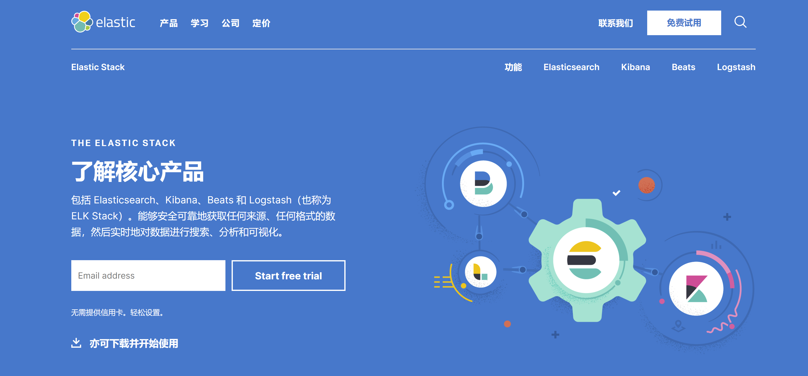
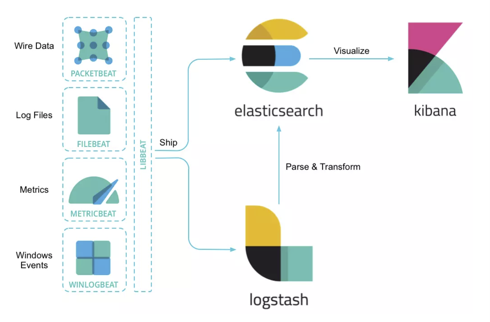

# Docker部署Elastic Stack

## 资料

官方镜像地址：[Docker @ Elastic](https://www.docker.elastic.co/#)

第三方整合dockerhub仓库地址：[sebp/elk](https://hub.docker.com/r/sebp/elk/)

第三方整合文档：https://elk-docker.readthedocs.io/

Github上别人整理的一套使用docker compose来部署elk的配置：[docker-elk](https://github.com/deviantony/docker-elk)

## 介绍

ELK可能是现如今最为流行，并且更新速度最快的开源大数据产品，由elastic公司维护并完全开源。

ELK分别为：

- Elasticsearch: 核心中的核心组件，基于著名的全文检索引擎lucence的一个分布式版本。由于扩展成分布式，容量和性能得到极大的提升，使得Elasticsearch得以成为目前许多大数据产品和大数据架构的核心组件。
- Logstash: 一个灵活的数据传输和处理系统，在beats出来之前，还负责进行数据收集。Logstash的任务，就是将各种各样的数据，经过配置转化规则，统一化存入Elasticsearch。使用Ruby开发的Logstash在灵活性上，确实非常出色。不过性能一直是被诟病的问题。
- Kibana: 展示组件，基于angularjs。从Elasticsearch中读取数据并展示。具有强大而且灵活的界面配置。

由于Logstash在数据收集上并不出色，而且作为agent，性能并不达标。elastic发布了beats系列轻量级采集组件。至此，elastic形成了一个完整的生态链和技术栈，成为大数据市场的佼佼者。

这个产品被官方称之为：[Elastic Stack](https://www.elastic.co/cn/products/elastic-stack)





---

**ELK Stack 安装顺序**：

- Elasticsearch (install instructions)主要搜索引擎
- Kibana (install)图形化web界面
- Logstash (install)log的汇总与收集（server端）
- Beats (install instructions)log收集（client端）
- APM Server

---

**Beats介绍**：

beats是一组轻量级采集程序的统称，这些采集程序包括并不限于：

- filebeat: 进行文件和目录采集，主要用于收集日志数据。
- metricbeat: 进行指标采集，指标可以是系统的，也可以是众多中间件产品的，主要用于监控系统和软件的性能。
- packetbeat: 通过网络抓包、协议分析，对一些请求响应式的系统通信进行监控和数据收集，可以收集到很多常规方式无法收集到的信息。
- Winlogbeat: 专门针对windows的event log进行的数据采集。
- Heartbeat: 系统间连通性检测，比如icmp, tcp, http等系统的连通性监控。

以上是elastic官方支持的5种beats，事实上，伟大的开源力量早已创造出大大小小几十甚至上百中beats，只有你没想到的，没有beats做不到的。

为什么说beats是轻量级的呢？主要是beats在数据收集层面上并不进行过于复杂的数据处理，只是将数据简单的组织并上报给上游系统。另一方便，由于beats采用go语言开发，go是一种系统编程语言，具有并发友好以及部署方便的特点，能够在不依赖虚拟机的情况下运行，包大小通常也比较小。在跨平台上方面，beats与go语言保持一致支持linux，windows，freebsd和macos。beats的性能，明显好于大哥Logstash，一个设计良好的go语言程序基本可以达到甚至超过java程序。

## 拉取镜像

```bash
docker pull sebp/elk
```

## 启动运行

```bash
docker run -p 5601:5601 -p 9200:9200 -p 5044:5044 -it -d --name elk sebp/elk
```

注意：分配给docker的内存需要大于4G

修改logstash关闭ssl

```bash
 1、进入elk容器
docker exec -it xxxxx(elk容器的ID) /bin/bash
 2、修改配置文件 改为如下
vi /etc/logstash/conf.d/02-beats-input.conf

input {
  beats {
    port => 5044
    ssl => true
    ssl_certificate => "/etc/pki/tls/certs/logstash-beats.crt"
    ssl_key => "/etc/pki/tls/private/logstash-beats.key"
  }
}

变更为

input {
  beats {
    port => 5044
    #把这里原本的用于正式的配置项删除
  }
}
```

修改后，重启

## 访问

kibana访问地址: http://127.0.0.1:5601/
elasticsearch访问地址: http://127.0.0.1:9200

## kibana汉化

```bash
docker exec -it <kibana_container_id> /bin/bash

find / -name kibana.yml

vim /opt/kibana/config/kibana.yml
```

末尾添加

```text
i18n.locale: "zh-CN"
```
