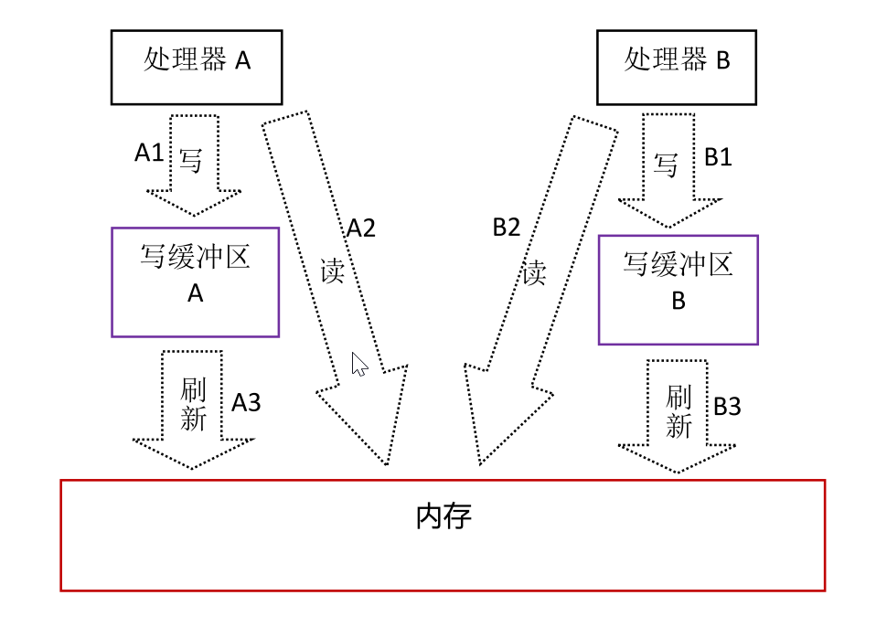
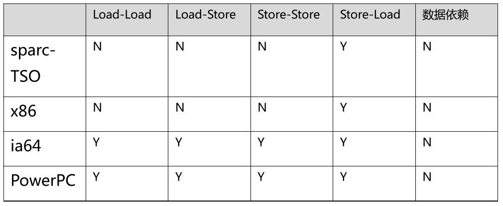

# 基础

- [基础](#基础)
  - [并发编程模型](#并发编程模型)
  - [Java内存模型的抽象](#java内存模型的抽象)
  - [重排序](#重排序)
  - [处理器重排序和内存屏障](#处理器重排序和内存屏障)
  - [happens-before](#happens-before)
  - [学习参考](#学习参考)

## 并发编程模型

并发编程中要处理的两个关键问题：

- 线程之间如何通信
- 线程之间如何同步

针对这两个问题，首先需要了解其中的相关概念。

**通信**是指线程之间以何种机制来交换信息。

命令式编程中，线程之间的通信机制有两种：

- 共享内存
- 消息传递

共享内存的并发模型中，线程之间共享线程的公共状态，线程之间通过写-读内存中的公共状态来隐式进行通信。

消息传递的并发模型中，线程之间没有公共状态，线程之间必须通过明确的发送消息来显式进行通信。

**同步**是指程序用于控制不同线程之间操作发生相对顺序的机制。

共享内存的并发模型中，同步是显式进行的。程序员必须显式指定某个方法或者某段代码需要在线程之间互斥执行。

消息传递的并发模型中，由于消息的发送必须在消息接收之前，因此同步是隐式进行的。

**Java的并发采用的是共享内存模型**，Java 线程之间的通信总是隐式进行，整个通信过程对程序员完全透明。如果编写多线程程序的 Java 程序员不理解隐式进行的线程之间通信的工作机制，很可能遇到各种奇怪的内存可见性问题。

总结一下：

- Java 中采用的是共享内存的并发模型
- 共享内存的并发模型中，线程之间通过写 - 读内存中的公共状态来隐式进行通信
- 共享内存的并发模型中，同步是显式进行的。
- 学习目的：解决和避免各种内存可见性问题

## Java内存模型的抽象

在 Java 中，所有实例域、静态域、和数组元素存储在堆内存中，堆内存在线程之间共享（后续使用"共享变量"这个术语代指实例域，静态域和数组元素）。
局部变量、方法定义参数和异常处理器参数不会在线程之间共享，它们不会有内存可见性问题，也不受内存模型的影响。

Java 线程之间的通信由 Java 内存模型（简称为JMM）控制，JMM 决定一个线程对共享变量的写入何时对另一个线程可见。
从抽象的角度来看，JMM 定义了线程和主内存之间的抽象关系：线程之间的共享变量存储在主内存（main memory）中，每个线程都有一个私有的本地内存（local memory），本地内存中存储了该线程以读/写共享变量的副本。本地内存是JMM的一个抽象概念，并不是真实存在。它涵盖了缓存、写缓冲区、寄存器以及其他硬件和编译器的优化。

Java 内存，模型的抽象示意图如下：

从模型图来看，线程 A 与线程 B 要进行通信,必须经历两个步骤：

1. 线程 A 将本地内存 A 中更新过的共享变量刷新到主内存中
2. 线程 B 到主内存中读取线程 A 之前已更新的共享变量

JMM 通过控制主内存与每个线程的本地内存之间的交互，来为 Java 程序员提供内存可见性的保证。

## 重排序

在执行程序时，为了提高性能，编译器和处理器常常会对指令做**重排序**。

重排序分为三种类型：

1. 编译器优化的重排序。编译器在不改变单线程程序语义的前提下，可以重新安排语句的执行顺序。
2. 指令级并行的重排序。现代处理器采用了指令级并行技术（Instruction-Level Parallelism,ILP）来将多条指令重叠执行。如果不存在数据依赖性，处理器可以改变语句对应机器指令的执行顺序。
3. 内存系统的重排序。由于处理器使用缓存和读/写缓冲区，这使得加载和存储操作看上去可能是在乱序执行。

从 Java 源代码到最终实际执行的指令序列，会分别经历下面三种重排序：

源代码 -> 1.编译器优化重排序 -> 2.指令级并行重排序 -> 3.内存系统重排序 -> 最终执行的指令序列

上述的1属于**编译器重排序**，2和3属于**处理器重排序**，这些重排序都可能会导致多线程程序出现内存可见性的问题。

对于编译器重排序，JMM 的编译器重排序规则会禁止特定类型的编译器重排序（不是所有的编译器重排序都要禁止）。
对于处理器重排序，JMM 的处理器重排序规则会要求 Java 编译器在生成指令序列时，插入特定类型的内存屏障（memory barriers，intel 称之为 memory fence）指令，通过内存屏障指令来禁止特定类型的处理器重排序（不是所有的处理器重排序都要禁止。）

JMM 属于语言级的内存模型，它确保在不同的编译器和不同的处理器平台上，通过禁止特定类型的编译器重排序和处理器重排序，为程序员提供一致的内存可见性保证。

## 处理器重排序和内存屏障

现代处理器使用写缓冲区来临时保存向内存写入的数据。
写缓冲区可以保证指令流水线持续运行，它可以避免由于处理器停顿下来等待向内存写入数据而产生的延迟。同时，通过以批处理的方式刷新写缓冲区，以及合并写缓冲区中对同一内存地址的多次写，可以减少对内存总线的占用。

虽然写缓冲区有这么多的好处，但每个处理器上的写缓冲区，仅仅对它所在的处理器可见。这个特性会对内存操作的执行顺序产生重要的影响：
> 处理器对内存的读/写操作的执行顺序，不一定与内存实际发生的读/写操作顺序一致。

为了具体说明，请看下面示例：

假设处理器 A 和处理器 B 按程序的顺序并行执行内存访问，最终却可能得到 **x = y = 0** 的结果。具体的原因如下图所示：

这里处理器 A 和处理器 B 可以同时把共享变量写入自己的写缓冲区（A1，B1），然后从内存中读取另一个共享变量（A2，B2），最后才把自己写缓冲区中保存的脏数据刷新到内存中（A3，B3）。当以这种时序执行时，程序就可以得到 **x = y = 0** 的结果。

从内存操作的实际发生的顺序来看，直到处理器 A 执行 A3 来刷新自己的写缓冲区，写操作 A1 才算真正执行了。虽然处理器 A 执行内存操作的顺序为：**A1 -> A2** ，但内存操作实际发生的顺序却是： **A2 -> A1** 。此时，处理器 A 的内存操作顺序被重排了（处理器 B 的情况和处理器 A 一样，这里不赘述了）。

这里的关键是，由于写缓冲区仅对自己的处理器可见，它会导致处理器执行内存操作的顺序可能会与内存实际的操作执行顺序不一致。由于现代的处理器都会使用写缓冲区，因此现代的处理器都会允许对写 - 读操作重排序。

下面是常见处理器允许的重排序类型列表：

上表单元格的"N"表示处理器不允许两个操作重排序，"Y"表示允许重排序。

从上表中我们可以看出：常见的处理器都允许 **Store-Load** 重排序；常见的处理器都不允许对存在数据依赖的操作做重排序。sparc-TSO 和 x86 拥有相对较强的处理器内存模型，它们仅允许对写 - 读操作做重排序（因为它们都使用了写缓冲区）。

注释：

- sparc-TSO 是指以 TSO（Total Store Order）内存模型运行时，sparc 处理器的特性
- 上表中的 x86 包括 x64 及 AMD64
- 由于 ARM 处理器的内存模型与 PowerPC 处理器的内存模型非常类似，本文将忽略它
- 数据依赖性后文会专门说明

为了保证内存可见性，Java 编译器在生成指令序列的适当位置会插入内存屏障指令来禁止特定类型的处理器重排序。JMM 把内存屏障指令分为下列四类：

| 屏障类型            | 指令示例                   | 说明                                                                                                                                                                                                    |
| ------------------- | -------------------------- | ------------------------------------------------------------------------------------------------------------------------------------------------------------------------------------------------------- |
| LoadLoad Barriers   | Load1；LoadLoad；Load2     | 确保Load1数据的装载，之前于Load2及所有后续装载指令的装载                                                                                                                                                |
| StoreStore Barriers | Store1；StoreStore；Store2 | 确保Store1数据对其他处理器可见（刷新到内存），之前于Store2及所有后续存储指令的存储。                                                                                                                    |
| LoadStore Barriers  | Load1,；LoadStore；Store2  | 确保Load1数据装载，之前于Store2及所有后续的存储指令刷新到内存。                                                                                                                                         |
| StoreLoad Barriers  | Store1；StoreLoad；Load2   | 确保Store1数据对其他处理器变得可见（指刷新到内存），之前于Load2及所有后续装载指令的装载。StoreLoad Barriers会使该屏障之前的所有内存访问指令（存储和装载指令）完成之后，才执行该屏障之后的内存访问指令。 |

StoreLoad Barriers 是一个"全能型"的屏障，它同时具有其他三个屏障的效果。现代的多处理器大都支持该屏障（其他类型的屏障不一定被所有处理器支持）。执行该屏障开销会很昂贵，因为当前处理器通常要把写缓冲区中的数据全部刷新到内存中（buffer fully flush）。

## happens-before

从 JDK5 开始，Java 开始使用新的 **JSR-133** 内存模型（本文除非特别说明，针对的都是 JSR-133 内存模型）。JSR-133 使用 happens-before 的概念来阐述操作之间的内存可见性。在JMM中，如果一个操作执行的结果需要对另一个操作可见，那么这两个操作之间必须要存在 happens-before 关系。这里提到的两个操作既可以是在一个线程之内，也可以是在不同线程之间。

与程序员密切相关的 happens-before 规则如下：

- 程序顺序规则：一个线程中的每个操作，happens-before 于该线程中任意后续操作
- 监视器锁规则：对一个监视器的解锁，happens-before 于随后对这个监视器的加锁
- volatile 变量规则：对一个 volatile 域的写，happens-before 于任意后续对这个 volatile 域的读。
- 传递性：如果A happens-before B，且B happens-before C，那么A happens-before C。

注意，两个操作之间具有 happens-before 关系，并不意味着前一个操作必须要在后一个操作之前执行！happens-before 仅仅要求前一个操作（执行的结果）对后一个操作可见，且前一个操作按顺序排在第二个操作之前（the first is visible to and ordered before the second）。happens-before的定义很微妙，后文会具体说明 happens-before 为什么要这么定义。

happens-before 与 JMM 的关系如下图所示：

如上图所示，一个 happens-before 规则对应于一个或多个编译器和处理器重排序规则。对于 Java 程序员来说，happens-before 规则简单易懂，它避免Java程序员为了理解 JMM 提供的内存可见性保证而去学习复杂的重排序规则以及这些规则的具体实现。

## 学习参考

- [《深入理解Java内存模型》 - 程晓明 著](https://www.infoq.cn/article/java_memory_model)
- [Java memory model - Wikipedia](https://en.wikipedia.org/wiki/Java_memory_model)