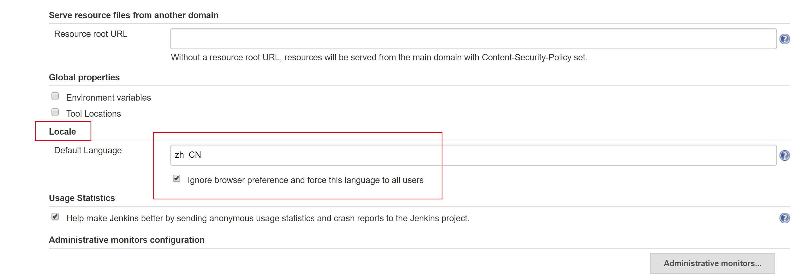

# Docker部署Jenkins

官方镜像：[Jenkins](https://hub.docker.com/_/jenkins/)
Jenkins镜像：[jenkins/jenkins](https://hub.docker.com/r/jenkins/jenkins)

## 拉取镜像

```bash
docker pull jenkins/jenkins
```

## 创建目录

```bash
cd ~
mkdir jenkins
cd jenkins
mkdir home
```

## 启动运行

```bash
cd ~
docker run -d  -it --name jenkins -p 8080:8080 -p 50000:50000 -v $PWD/jenkins/home:/var/jenkins_home jenkins/jenkins:latest
```

命令说明：

- -d ： 后台运行
- -p 8080:8080 ： 8080为jenkins网页访问的端口
- -p 50000:50000 ： 50000端口与slave有关
- -v ： 挂载jenkins工作目录

此时，运行报错：

```text
touch: cannot touch '/var/jenkins_home/copy_reference_file.log': Permission denied
Can not write to /var/jenkins_home/copy_reference_file.log. Wrong volume permissions?
```

需要修改下目录权限, 因为当映射本地数据卷时，~/jenkins/home目录的拥有者为root用户，而容器中jenkins user的uid为1000

```bash
sudo chown -R 1000:1000 ~/jenkins/home
```

重启启动运行容器即可。

## 初始化

登录启动的jenkins，会提示输入initialAdminPassword，进入挂载目录中找到输入即可：

```bash
cd ~/jenkins/home/secrets
cat initialAdminPassword
```

## jenkins配置

### 避免插件安装失败

刚登录Jenkins，不要下载安装插件，因为默认的插件站点需要代理才能访问，这里选择跳过插件安装。

在 `jenkins->系统管理->管理插件->高级` 中选择升级站点，将：

```text
http://updates.jenkins-ci.org/update-center.json
```

替换为：

```text
https://mirrors.tuna.tsinghua.edu.cn/jenkins/updates/update-center.json
```

或者

```text
http://mirror.esuni.jp/jenkins/updates/update-center.json
```

## 汉化

在 `Jenkins - Manage Jenkins - Plugin Manager` 插件管理中点击 `Available` 可安装的插件，搜索一下插件安装：

- Locale plugin
- Localization Support
- Localization: Chinese (Simplified)

安装完成后，重启，在 `Jenkins - Manage Jenkins - Configure System` 中搜索 `Locale` ，将 Default Language 设置为 ： zh_CN



设置完成，点击 Apply 和 Save 后重启即可。

附：

- “zh_CN”简体中文，"zh_TW"繁体中文。
- 若中文显示不完全，可以将 Default Language 设置为：zh_US后，重启，再重新设置回：zh_CN

## 备注

镜像查询地址：

```text
http://mirrors.jenkins-ci.org/status.html
```
