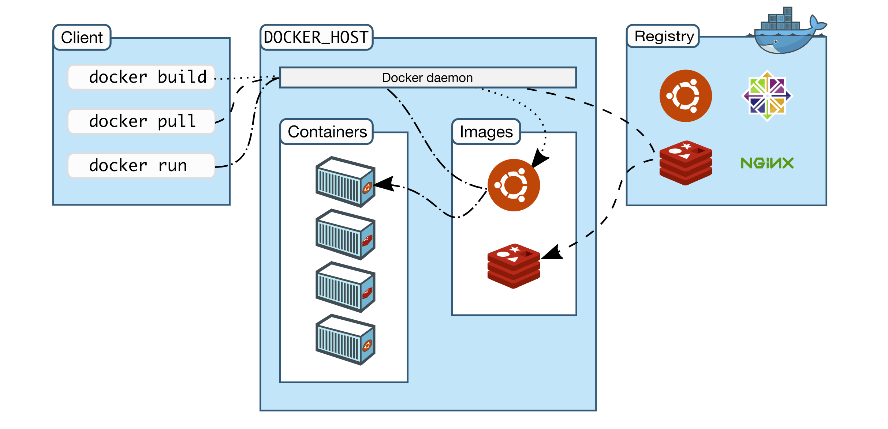

# CentOS7安装Docker



## 一、安装Docker

1、Docker 要求 CentOS 系统的内核版本高于 3.10 ，查看本页面的前提条件来验证你的 CentOS 版本是否支持 Docker 。

通过 uname -r 命令查看你当前的内核版本

```bash
uname -r
```

2、使用 root 权限登录 Centos。确保 yum 包更新到最新。

```bash
sudo yum update
```

3、卸载旧版本(如果安装过旧版本的话)

```bash
sudo yum remove docker  docker-common docker-selinux docker-engine
```

4、安装需要的软件包， yum-util 提供yum-config-manager功能，另外两个是devicemapper驱动依赖的

```bash
sudo yum install -y yum-utils device-mapper-persistent-data lvm2
```

5、设置yum源

```bash
sudo yum-config-manager --add-repo https://download.docker.com/linux/centos/docker-ce.repo
```

设置yum源为阿里云

```bash
sudo yum‐config‐manager ‐‐add‐repo http://mirrors.aliyun.com/dockerce/linux/centos/docker‐ce.repo
```

6、可以查看所有仓库中所有docker版本，并选择特定版本安装

```bash
yum list docker-ce --showduplicates | sort -r
```

7、安装docker

```bash
sudo yum install docker-ce  #由于repo中默认只开启stable仓库，故这里安装的是最新稳定版
sudo yum install docker-ce-<VERSION_STRING> docker-ce-cli-<VERSION_STRING> containerd.io  # 例如：sudo yum install docker-ce-19.03.4 docker-ce-cli-19.03.4 containerd.io
```

8、启动并加入开机启动

```bash
sudo systemctl start docker
sudo systemctl enable docker
```

9、验证安装是否成功(有client和service两部分表示docker安装启动都成功了)

```bash
docker version
```

10、通过运行hello-world 映像来验证是否正确安装了Docker Engine-Community 。

```bash
docker run hello-world
```

此命令下载测试图像并在容器中运行。容器运行时，它会打印参考消息并退出。

## 二、Docker升级至最新稳定版本

1、卸载旧版本

较旧的Docker版本称为docker或docker-engine。如果已安装这些程序，请卸载它们以及相关的依赖项。

```bash
sudo yum remove docker \
                  docker-client \
                  docker-client-latest \
                  docker-common \
                  docker-latest \
                  docker-latest-logrotate \
                  docker-logrotate \
                  docker-engine
```

2、安装所需的软件包。yum-utils提供了yum-config-manager 效用，并device-mapper-persistent-data和lvm2由需要 devicemapper存储驱动程序。

```bash
sudo yum install -y yum-utils \
  device-mapper-persistent-data \
  lvm2
```

3.使用以下命令来设置稳定的存储库。

```bash
sudo yum-config-manager \
    --add-repo \
    https://download.docker.com/linux/centos/docker-ce.repo
```

4、后续重复安装步骤即可

## 三、Docker镜像加速

阿里云官方镜像加速教程：[官方教程](https://cr.console.aliyun.com/)

```markdown
1. 安装／升级Docker客户端
推荐安装1.10.0以上版本的Docker客户端，参考文档 [docker-ce](https://yq.aliyun.com/articles/110806)

2. 配置镜像加速器
针对Docker客户端版本大于 1.10.0 的用户

您可以通过修改daemon配置文件/etc/docker/daemon.json来使用加速器
sudo mkdir -p /etc/docker
sudo tee /etc/docker/daemon.json <<-'EOF'
{
  "registry-mirrors": ["https://xxx.mirror.aliyuncs.com"]
}
EOF
sudo systemctl daemon-reload
sudo systemctl restart docker
```

其他镜像加速地址：

```bash
#Docker中国官方镜像加速
{
  "registry-mirrors": ["https://registry.docker-cn.com"]
}

#ustc
{
  "registry-mirrors": ["https://docker.mirrors.ustc.edu.cn"]
}
```

## 其他

`systemctl`命令是系统服务管理器指令。

启动docker：

```bash
systemctl start docker
```

停止docker：

```bash
systemctl stop docker
```

重启docker：

```bash
systemctl restart docker
```

查看docker状态：

```bash
systemctl status docker
```

开机启动：

```bash
systemctl enable docker
```

查看docker概要信息：

```bash
docker info
```

查看docker帮助文档：

```bash
docker ‐‐help
```

## 四、资料

- 官方CentOS安装教程：[官方教程](https://docs.docker.com/install/linux/docker-ce/centos/)
- docker中文：[Docker资源](http://www.docker.org.cn/page/resources.html)
