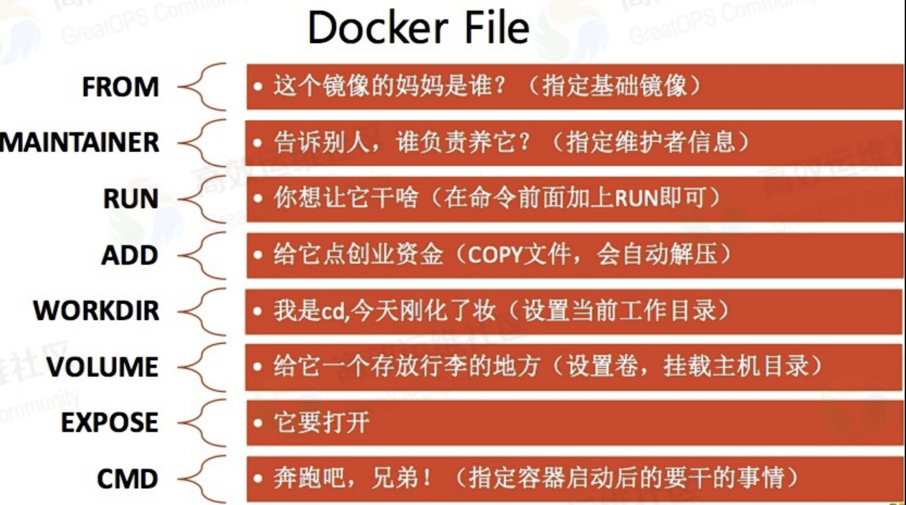

# Docker Dockerfile 详解

官方文档：[Dockerfile reference](https://docs.docker.com/engine/reference/builder/)

官方最佳实践：[Best practices for writing Dockerfiles](https://docs.docker.com/develop/develop-images/dockerfile_best-practices/)

## 介绍

Docker通过读取Dockerfile里面的内容可以自动build image，Dockerfile是一个包含了build过程中需要执行的所有命令的文本文件。也可以理解为Dockfile是一种被Docker程序解释的脚本，由一条一条的指令组成，每条指令对应Linux系统下面的一条命令，由Docker程序将这些Dockerfile指令翻译成真正的Linux命令。Dockerfile有自己书写格式和支持的命令，Docker程序解决这些命令间的依赖关系，类似于Makefile。

Docker程序将读取Dockerfile，根据指令生成定制的image。相比image这种黑盒子，Dockerfile这种显而易见的脚本更容易被使用者接受，它明确的表明image是怎么产生的。有了Dockerfile，当我们需要定制自己额外的需求时，只需在Dockerfile上添加或者修改指令，重新生成image即可，省去了敲命令的麻烦。

`docker build`命令用于从Dockerfile构建image。可以在`docker build`命令中使用`-f`标志指向文件系统中任何位置的Dockerfile。

例：

```bash
docker build -f /path/to/a/Dockerfile
```

## Dockerfile编写规则及指令说明

Dockerfile的指令是忽略大小写的，建议使用大写，使用#作为注释，每一行只支持一条指令，每条指令可以携带多个参数。

Dockerfile的指令根据作用可以分为两种：构建指令和设置指令。构建指令用于构建image，其指定的操作不会在运行image的容器上执行；设置指令用于设置image的属性，其指定的操作将在运行image的容器中执行。

## Dockerfile的基本结构

Dockerfile 一般分为四部分：

- 基础镜像信息
- 维护者信息
- 镜像操作指令和容器启动时执行指令
- `#` 为 Dockerfile 中的注释

## Dockerfile文件说明

Docker以从上到下的顺序运行Dockerfile的指令。

为了指定基本映像，第一条指令必须是FROM。一个声明以＃字符开头则被视为注释。

可以在Docker文件中使用RUN，CMD，FROM，EXPOSE，ENV等指令。

## 常用指令说明



|命令|作用|
|---------|---------|
|FROM image_name:tag|定义了使用哪个基础镜像启动构建流程|
|MAINTAINER user_name|声明镜像的创建者|
|ENV key value|设置环境变量 (可以写多条)|
|RUN command|用于在镜像容器中执行命令，是Dockerfile的核心部分(可以写多条)|
|ADD source_dir/file dest_dir/file|将宿主机的文件复制到容器内，如果是一个压缩文件， 将会在复制后自动解压|
|COPY source_dir/file dest_dir/file|和ADD相似，但是如果有压缩文件并不能解压|
|WORKDIR path_dir|设置工作目录|

**FROM**：指定基础镜像，必须为第一个命令

格式：

```dockerfile
FROM <image>
FROM <image>:<tag>
FROM <image>@<digest>
```

示例：

```dockerfile
FROM mysql:5.6
```

注：tag或digest是可选的，如果不使用这两个值时，会使用latest版本的基础镜像

---

**MAINTAINER**: 维护者信息

格式：

```dockerfile
MAINTAINER <name>
```

示例：

```dockerfile
MAINTAINER Jasper Xu
MAINTAINER sorex@163.com
MAINTAINER Jasper Xu <sorex@163.com>
```

---

**RUN**：构建镜像时执行的命令

RUN用于在镜像容器中执行命令，其有以下两种命令执行方式：

shell执行，格式：

```dockerfile
RUN <command>
```

exec执行，格式：

```dockerfile
RUN ["executable", "param1", "param2"]
```

示例：

```dockerfile
RUN ["executable", "param1", "param2"]
RUN apk update
RUN ["/etc/execfile", "arg1", "arg1"]
```

注：RUN指令创建的中间镜像会被缓存，并会在下次构建中使用。如果不想使用这些缓存镜像，可以在构建时指定--no-cache参数，如：docker build --no-cache

---

**ADD**：将本地文件添加到容器中，tar类型文件会自动解压(网络压缩资源不会被解压)，可以访问网络资源，类似wget

格式：

```dockerfile
ADD <src>... <dest>
ADD ["<src>",... "<dest>"] 用于支持包含空格的路径
```

示例：

```dockerfile
ADD hom* /mydir/          # 添加所有以"hom"开头的文件
ADD hom?.txt /mydir/      # ? 替代一个单字符,例如："home.txt"
ADD test relativeDir/     # 添加 "test" 到 `WORKDIR`/relativeDir/
ADD test /absoluteDir/    # 添加 "test" 到 /absoluteDir/
```

---

**COPY**：功能类似ADD，但是是不会自动解压文件，也不能访问网络资源

---

**CMD**：构建容器后调用，也就是在容器启动时才进行调用。

格式：

```dockerfile
CMD ["executable","param1","param2"] (执行可执行文件，优先)
CMD ["param1","param2"] (设置了ENTRYPOINT，则直接调用ENTRYPOINT添加参数)
CMD command param1 param2 (执行shell内部命令)
```

示例：

```dockerfile
CMD echo "This is a test." | wc -
CMD ["/usr/bin/wc","--help"]
```

注：CMD不同于RUN，CMD用于指定在容器启动时所要执行的命令，而RUN用于指定镜像构建时所要执行的命令。

---

**ENTRYPOINT**：配置容器，使其可执行化。配合CMD可省去"application"，只使用参数。

格式：

```dockerfile
ENTRYPOINT ["executable", "param1", "param2"] (可执行文件, 优先)
ENTRYPOINT command param1 param2 (shell内部命令)
```

示例：

```dockerfile
FROM ubuntu
ENTRYPOINT ["top", "-b"]
CMD ["-c"]
```

注：

- ENTRYPOINT与CMD非常类似，不同的是通过docker run执行的命令不会覆盖ENTRYPOINT，而docker run命令中指定的任何参数，都会被当做参数再次传递给ENTRYPOINT。
- Dockerfile中只允许有一个ENTRYPOINT命令，多指定时会覆盖前面的设置，而只执行最后的ENTRYPOINT指令。

---

**LABEL**：用于为镜像添加元数据

格式：

```dockerfile
LABEL <key>=<value> <key>=<value> <key>=<value> ...
```

示例：

```dockerfile
LABEL version="1.0" description="这是一个Web服务器" by="IT笔录"
```

注：使用LABEL指定元数据时，一条LABEL指定可以指定一或多条元数据，指定多条元数据时不同元数据之间通过空格分隔。推荐将所有的元数据通过一条LABEL指令指定，以免生成过多的中间镜像。

---

**ENV**：设置环境变量

格式：

```dockerfile
ENV <key> <value>  #<key>之后的所有内容均会被视为其<value>的组成部分，因此，一次只能设置一个变量
ENV <key>=<value> ...  #可以设置多个变量，每个变量为一个"<key>=<value>"的键值对，如果<key>中包含空格，可以使用\来进行转义，也可以通过""来进行标示；另外，反斜线也可以用于续行
```

示例：

```dockerfile
ENV myName John Doe
ENV myDog Rex The Dog
ENV myCat=fluffy
```

---

**EXPOSE**：指定于外界交互的端口

格式：

```dockerfile
EXPOSE <port> [<port>...]
```

示例：

```dockerfile
EXPOSE 80 443
EXPOSE 8080
EXPOSE 11211/tcp 11211/udp
```

注：EXPOSE并不会让容器的端口访问到主机。要使其可访问，需要在docker run运行容器时通过-p来发布这些端口，或通过-P参数来发布EXPOSE导出的所有端口

---

**VOLUME**：用于指定持久化目录

格式：

```dockerfile
VOLUME ["/path/to/dir"]
```

示例：

```dockerfile
VOLUME ["/data"]
VOLUME ["/var/www", "/var/log/apache2", "/etc/apache2"
```

注：一个卷可以存在于一个或多个容器的指定目录，该目录可以绕过联合文件系统，并具有以下功能：

- 卷可以容器间共享和重用
- 容器并不一定要和其它容器共享卷
- 修改卷后会立即生效
- 对卷的修改不会对镜像产生影响
- 卷会一直存在，直到没有任何容器在使用它

---

**WORKDIR**：工作目录，类似于cd命令

格式：

```dockerfile
WORKDIR /path/to/workdir
```

示例：

```dockerfile
WORKDIR /a  (这时工作目录为/a)
WORKDIR b  (这时工作目录为/a/b)
WORKDIR c  (这时工作目录为/a/b/c)
```

注：通过WORKDIR设置工作目录后，Dockerfile中其后的命令RUN、CMD、ENTRYPOINT、ADD、COPY等命令都会在该目录下执行。在使用docker run运行容器时，可以通过-w参数覆盖构建时所设置的工作目录。

---

**USER**:指定运行容器时的用户名或 UID，后续的 RUN 也会使用指定用户。使用USER指定用户时，可以使用用户名、UID或GID，或是两者的组合。当服务不需要管理员权限时，可以通过该命令指定运行用户。并且可以在之前创建所需要的用户

格式：

```dockerfile
USER user
USER user:group
USER uid
USER uid:gid
USER user:gid
USER uid:group
```

示例：

```dockerfile
USER www
```

注：使用USER指定用户后，Dockerfile中其后的命令RUN、CMD、ENTRYPOINT都将使用该用户。镜像构建完成后，通过docker run运行容器时，可以通过-u参数来覆盖所指定的用户。

---

**ARG**：用于指定传递给构建运行时的变量

格式：

```dockerfile
ARG <name>[=<default value>]
```

示例：

```dockerfile
ARG site
ARG build_user=www
```

---

**ONBUILD**：用于设置镜像触发器

格式：

```dockerfile
ONBUILD [INSTRUCTION]
```

示例：

```dockerfile
ONBUILD ADD . /app/src
ONBUILD RUN /usr/local/bin/python-build --dir /app/src
```

注：当所构建的镜像被用做其它镜像的基础镜像，该镜像中的触发器将会被钥触发

## 示例

```dockerfile
# This my first nginx Dockerfile
# Version 1.0

# Base images 基础镜像
FROM centos

#MAINTAINER 维护者信息
MAINTAINER weihuzhe

#ENV 设置环境变量
ENV PATH /usr/local/nginx/sbin:$PATH

#ADD  文件放在当前目录下，拷过去会自动解压
ADD nginx-1.8.0.tar.gz /usr/local/  
ADD epel-release-latest-7.noarch.rpm /usr/local/  

#RUN 执行以下命令
RUN rpm -ivh /usr/local/epel-release-latest-7.noarch.rpm
RUN yum install -y wget lftp gcc gcc-c++ make openssl-devel pcre-devel pcre && yum clean all
RUN useradd -s /sbin/nologin -M www

#WORKDIR 相当于cd
WORKDIR /usr/local/nginx-1.8.0

RUN ./configure --prefix=/usr/local/nginx --user=www --group=www --with-http_ssl_module --with-pcre && make && make install

RUN echo "daemon off;" >> /etc/nginx.conf

#EXPOSE 映射端口
EXPOSE 80

#CMD 运行以下命令
CMD ["nginx"]
```

## 构建镜像时需要注意的几点

- 尽量使用官方镜像, 同时版本选择 `alpine > debian > ubuntu > centos`, `alpine`版本的镜像是最小的
- COPY 和 ADD 尽量使用 COPY, COPY 只是单纯的复制, ADD 则会自动执行一些东西, 有可能出现意料外的问题
- CMD 和 ENTERPOINT 这两个可以查一下区别, 我个人习惯用 CMD
- 容器中的程序都要前台执行的模式, 使用 daemon 模式会被退出(你想想本身一个后台运行的容器中有个后台运行的程序...)
- 每一个 RUN 指令就是一层缓存, 当其中一个步骤发生更改那么这之后的步骤也都重新构建
- 系统更新最好合成一个 RUN 比如:

```bash
RUN apk update && \
    apk upgrade && \
    apk add alpine-sdk linux-headers && \
    apk add autoconf gcc make
```

同样还是为了避免因为缓存时出现问题

- 多看看官方构建的镜像, 收获会很多, 比如 docker-nginx, docker-php

## 一个 Spring Boot 项目的 Dockerfile文件

```dockerfile
# 基于java镜像创建新镜像
FROM java:8
# 作者
MAINTAINER author
# 将jar包添加到容器中并更名为app.jar
ADD app.jar /root/docker_test/app.jar
# 运行jar包
ENTRYPOINT ["nohup","java","-jar","/root/docker_test/app.jar","&"]
```

制作镜像：

```bash
docker build -t springboot-app-demo .
```

命令说明：

- `-t`：指定新镜像名
- `.`：表示 dockerfile 在当前路径

如果 Dockerfile 文件路径不在这个目录下，或者有另外的文件名，可以通过 -f 选项单独给出 Dockerfile 文件的路径

```bash
docker build -t springboot-app-demo -f /root/docker_test/Dockerfile /root/docker_test/
```

命令说明：

- `-f`：第一个参数是Dockerfile的路径 第二个参数是Dockerfile所在文件夹

## 参考

- [Dockerfile文件详解](https://www.cnblogs.com/panwenbin-logs/p/8007348.html)