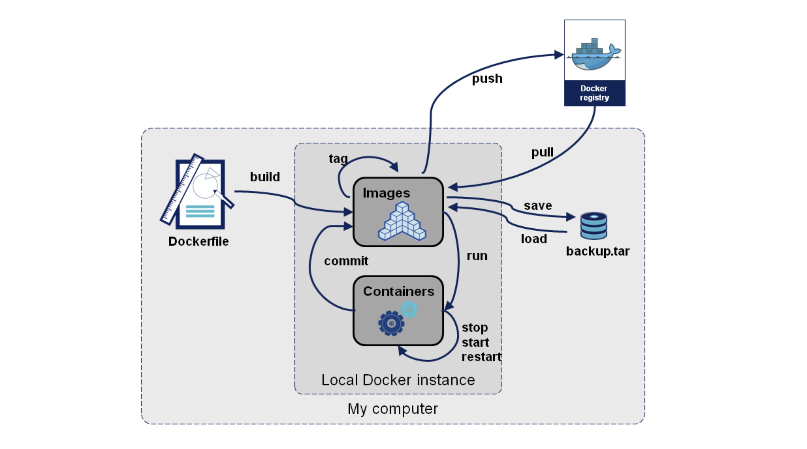

# Docker常用命令

官方命令文档：[Docker官网文档-Docker CLI](https://docs.docker.com/engine/reference/run/)
官方命令文档：[Docker官网文档-Dockerfile reference](https://docs.docker.com/engine/reference/builder/)

## Docker命令分类

- Docker环境信息 — docker [info|version]
- 容器生命周期管理 — docker [create|exec|run|start|stop|restart|kill|rm|pause|unpause]
- 容器操作运维 — docker [ps|inspect|top|attach|wait|export|port|rename|stat]
- 容器rootfs命令 — docker [commit|cp|diff]
- 镜像仓库 — docker [login|pull|push|search]
- 本地镜像管理 — docker [build|images|rmi|tag|save|import|load]
- 容器资源管理 — docker [volume|network]
- 系统日志信息 — docker [events|history|logs]

## Docker命令结构图



### Docker环境信息

**info命令**：

用于检测Docker是否正确安装，一般结合docker version命令使用。

**version命令**：

## 容器生命周期管理

**从image启动一个container（run）**：

docker run命令首先会从特定的image创之上create一层可写的container，然后通过start命令来启动它。停止的container可以重新启动并保留原来的修改。run命令启动参数有很多，以下是一些常规使用说明。

当利用 docker run 来创建容器时，Docker 在后台运行的标准操作包括：

- 检查本地是否存在指定的镜像，不存在就从公有仓库下载
- 利用镜像创建并启动一个容器
- 分配一个文件系统，并在只读的镜像层外面挂载一层可读写层
- 从宿主主机配置的网桥接口中桥接一个虚拟接口到容器中去
- 从地址池配置一个 ip 地址给容器
- 执行用户指定的应用程序
- 执行完毕后容器被终止
- Usage: docker run [OPTIONS] IMAGE [COMMAND] [ARG...]

> 使用image创建container并执行相应命令，然后停止

```bash
$ docker run ubuntu echo "hello world"
hello word
```

这是最简单的方式，跟在本地直接执行echo 'hello world' 几乎感觉不出任何区别，而实际上它会从本地ubuntu:latest镜像启动到一个容器，并执行打印命令后退出（docker ps -l可查看）。需要注意的是，默认有一个--rm=true参数，即完成操作后停止容器并从文件系统移除。因为Docker的容器实在太轻量级了，很多时候用户都是随时删除和新创建容器。
容器启动后会自动随机生成一个CONTAINER ID，这个ID在后面commit命令后可以变为IMAGE ID。

> 映射host到container的端口和目录：

映射主机到容器的端口是很有用的，比如在container中运行memcached，端口为11211，运行容器的host可以连接container的 internel_ip:11211 访问，如果有从其他主机访问memcached需求那就可以通过-p选项，形如`-p <host_port:contain_port>`，存在以下几种写法：

- -p 11211:11211 这个即是默认情况下，绑定主机所有网卡（0.0.0.0）的11211端口到容器的11211端口上
- -p 127.0.0.1:11211:11211 只绑定localhost这个接口的11211端口
- -p 127.0.0.1::5000
- -p 127.0.0.1:80:8080

目录映射其实是“绑定挂载”host的路径到container的目录，这对于内外传送文件比较方便，为了避免私服container停止以后保存的images不被删除，就要把提交的images保存到挂载的主机目录下。
使用比较简单，`-v <host_path:container_path>`，绑定多个目录时再加-v。

```bash
-v /tmp/docker:/tmp/docker
```

**开启/停止/重启container（start/stop/restart）**：

容器可以通过run新建一个来运行，也可以重新start已经停止的container，但start不能够再指定容器启动时运行的指令，因为docker只能有一个前台进程。
容器stop（或Ctrl+D）时，会在保存当前容器的状态之后退出，下次start时保有上次关闭时更改。而且每次进入attach进去的界面是一样的，与第一次run启动或commit提交的时刻相同。

```bash
docker stop $CONTAINER_ID
docker restart $CONTAINER_ID
```

**删除一个或多个container、image（rm、rmi）**：

你可能在使用过程中会build或commit许多镜像，无用的镜像需要删除。但删除这些镜像是有一些条件的：

- 同一个IMAGE ID可能会有多个TAG（可能还在不同的仓库），首先你要根据这些 image names 来删除标签，当删除最后一个tag的时候就会自动删除镜像；
- 承上，如果要删除的多个IMAGE NAME在同一个REPOSITORY，可以通过`docker rmi <image_id>`来同时删除剩下的TAG；若在不同Repo则还是需要手动逐个删除TAG；
- 还存在由这个镜像启动的container时（即便已经停止），也无法删除镜像；

## 容器运维操作

**查看容器的信息container（ps）**：

`docker ps`命令可以查看容器的CONTAINER ID、NAME、IMAGE NAME、端口开启及绑定、容器启动后执行的COMMNAD。最常用的功能是通过ps来找到CONTAINER_ID，以便对特定容器进行操作。
`docker ps`默认显示当前正在运行中的container
`docker ps -a`查看包括已经停止的所有容器
`docker ps -l`显示最新启动的一个容器（包括已停止的）

**inspect命令**：

用于查看镜像和容器的详细信息，默认会列出全部信息，可以通过--format参数来指定输出的模板格式，以便输出特定信息。

inspect的对象可以是image、运行中的container和停止的container。

查看容器的内部IP：

```bash
docker inspect --format='{{.NetworkSettings.IPAddress}}' $CONTAINER_ID
```

**attach命令**：

docker attach命令对应开发者很有用，可以连接到正在运行的容器，观察容器的运行状况，或与容器的主进程进行交互。

要attach上去的容器必须正在运行，可以同时连接上同一个container来共享屏幕（与screen命令的attach类似）。
官方文档中说attach后可以通过CTRL-C来detach，但实际上经过我的测试，如果container当前在运行bash，CTRL-C自然是当前行的输入，没有退出；如果container当前正在前台运行进程，如输出nginx的access.log日志，CTRL-C不仅会导致退出容器，而且还stop了。这不是我们想要的，detach的意思按理应该是脱离容器终端，但容器依然运行。好在attach是可以带上--sig-proxy=false来确保CTRL-D或CTRL-C不会关闭容器。

```bash
docker attach --sig-proxy=false $CONTAINER_ID
```

**查看容器中正在运行的进程（top）**：

容器运行时不一定有`/bin/bash`终端来交互执行top命令，查看container中正在运行的进程，况且还不一定有top命令，这是`docker top <container_id/container_name>`就很有用了。实际上在host上使用`ps -ef | grep docker`也可以看到一组类似的进程信息，把container里的进程看成是host上启动docker的子进程就对了。

## 容器rootfs命令

**将一个container固化为一个新的image（commit）**：

当我们在制作自己的镜像的时候，会在container中安装一些工具、修改配置，如果不做commit保存起来，那么container停止以后再启动，这些更改就消失了。

Usage: `docker commit <container> [repo:tag]`

后面的repo:tag可选
只能提交正在运行的container，即通过docker ps可以看见的容器，

## 镜像仓库

**在docker index中搜索image（search）**：

Usage: docker search TERM

```bash
docker search nginx
NAME                              DESCRIPTION                                     STARS               OFFICIAL            AUTOMATED
nginx                             Official build of Nginx.                        12118               [OK]
jwilder/nginx-proxy               Automated Nginx reverse proxy for docker con…   1678                                    [OK]
richarvey/nginx-php-fpm           Container running Nginx + PHP-FPM capable of…   744                                     [OK]
linuxserver/nginx                 An Nginx container, brought to you by LinuxS…   79
bitnami/nginx                     Bitnami nginx Docker Image                      72                                      [OK]
tiangolo/nginx-rtmp               Docker image with Nginx using the nginx-rtmp…   58                                      [OK]
nginxdemos/hello                  NGINX webserver that serves a simple page co…   31                                      [OK]
jlesage/nginx-proxy-manager       Docker container for Nginx Proxy Manager        27                                      [OK]
jc21/nginx-proxy-manager          Docker container for managing Nginx proxy ho…   26
nginx/nginx-ingress               NGINX Ingress Controller for Kubernetes         22
privatebin/nginx-fpm-alpine       PrivateBin running on an Nginx, php-fpm & Al…   18                                      [OK]
schmunk42/nginx-redirect          A very simple container to redirect HTTP tra…   17                                      [OK]
blacklabelops/nginx               Dockerized Nginx Reverse Proxy Server.          12                                      [OK]
centos/nginx-18-centos7           Platform for running nginx 1.8 or building n…   12
centos/nginx-112-centos7          Platform for running nginx 1.12 or building …   10
nginxinc/nginx-unprivileged       Unprivileged NGINX Dockerfiles                  9
webdevops/nginx                   Nginx container                                 8                                       [OK]
nginx/nginx-prometheus-exporter   NGINX Prometheus Exporter                       7
sophos/nginx-vts-exporter         Simple server that scrapes Nginx vts stats a…   5                                       [OK]
1science/nginx                    Nginx Docker images that include Consul Temp…   5                                       [OK]
mailu/nginx                       Mailu nginx frontend                            4                                       [OK]
pebbletech/nginx-proxy            nginx-proxy sets up a container running ngin…   2                                       [OK]
ansibleplaybookbundle/nginx-apb   An APB to deploy NGINX                          1                                       [OK]
centos/nginx-110-centos7          Platform for running nginx 1.10 or building …   0
wodby/nginx                       Generic nginx                                   0                                       [OK]
```

搜索的范围是官方镜像和所有个人公共镜像。NAME列的 / 后面是仓库的名字。

**从docker registry server 中下拉image或repository（pull）**：

Usage: `docker pull [OPTIONS] NAME[:TAG]`

```bash
docker pull centos
```

上面的命令需要注意，在docker v1.2版本以前，会下载官方镜像的centos仓库里的所有镜像，而从v.13开始官方文档里的说明变了：will pull the centos:latest image, its intermediate layers and any aliases of the same id，也就是只会下载tag为latest的镜像（以及同一images id的其他tag）。

也可以明确指定具体的镜像：

```bash
docker pull centos:centos6
```

当然也可以从某个人的公共仓库（包括自己是私人仓库）拉取，形如docker pull username/repository<:tag_name> ：

```bash
docker pull seanlook/centos:centos6
```

如果你没有网络，或者从其他私服获取镜像，形如`docker pull registry.domain.com:5000/repos:<tag_name>`

```bash
docker pull dl.dockerpool.com:5000/mongo:latest
```

**推送一个image或repository到registry（push）**：

与上面的pull对应，可以推送到Docker Hub的Public、Private以及私服，但不能推送到Top Level Repository。

```bash
docker push seanlook/mongo
docker push registry.tp-link.net:5000/mongo:2014-10-27
```

registry.tp-link.net也可以写成IP，如：172.29.88.222。
在repository不存在的情况下，命令行下push上去的会为我们创建为私有库，然而通过浏览器创建的默认为公共库。

## 本地镜像管理

**列出机器上的镜像（images）**：

```bash
$ docker images
REPOSITORY               TAG             IMAGE ID        CREATED         VIRTUAL SIZE
...
```

我们可以根据REPOSITORY来判断这个镜像是来自哪个服务器，如果没有 / 则表示官方镜像，类似于username/repos_name表示Github的个人公共库，类似于regsistory.example.com:5000/repos_name则表示的是私服。
IMAGE ID列其实是缩写，要显示完整则带上--no-trunc选项。

**docker build 使用此配置生成新的image**：

build命令可以从Dockerfile和上下文来创建镜像：

Usage: `docker build [OPTIONS] PATH | URL | -`

上面的PATH或URL中的文件被称作上下文，build image的过程会先把这些文件传送到docker的服务端来进行的。
如果PATH直接就是一个单独的Dockerfile文件则可以不需要上下文；如果URL是一个Git仓库地址，那么创建image的过程中会自动git clone一份到本机的临时目录，它就成为了本次build的上下文。无论指定的PATH是什么，Dockerfile是至关重要的。

官方网站文档：[Dockerfile reference](https://docs.docker.com/engine/reference/builder/)

**给镜像打上标签（tag）**：

tag的作用主要有两点：一是为镜像起一个容易理解的名字，二是可以通过docker tag来重新指定镜像的仓库，这样在push时自动提交到仓库。

将同一IMAGE_ID的所有tag，合并为一个新的：

```bash
docker tag <IMAGE ID> <REPOSITORY>
```

新建一个tag，保留旧的那条记录：

```bash
docker tag Registry/Repos:Tag New_Registry/New_Repos:New_Tag
```

## 容器资源管理

## 系统日志信息

**events、history和logs命令**：

这3个命令用于查看Docker的系统日志信息。events命令会打印出实时的系统事件；history命令会打印出指定镜像的历史版本信息，即构建该镜像的每一层镜像的命令记录；logs命令会打印出容器中进程的运行日志。

`docker events [options]` ：从服务器获取实时事件。

OPTIONS说明：

-f ：根据条件过滤事件；

--since ：从指定的时间戳后显示所有事件;

--until ：流水时间显示到指定的时间为止；

`docker history [options] image`：查看指定镜像的创建历史。

OPTIONS说明：

-H :以可读的格式打印镜像大小和日期，默认为true；

--no-trunc :显示完整的提交记录；

-q :仅列出提交记录ID。

`docker logs [options] container`

Options:
        --details        显示更多的信息
    -f, --follow         跟踪日志输出，最后一行为当前时间戳的日志
        --since string   显示自具体某个时间或时间段的日志
        --tail string    从日志末尾显示多少行日志， 默认是all
    -t, --timestamps     显示时间戳
