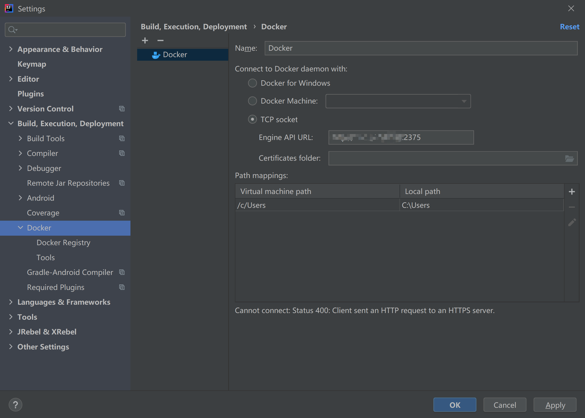
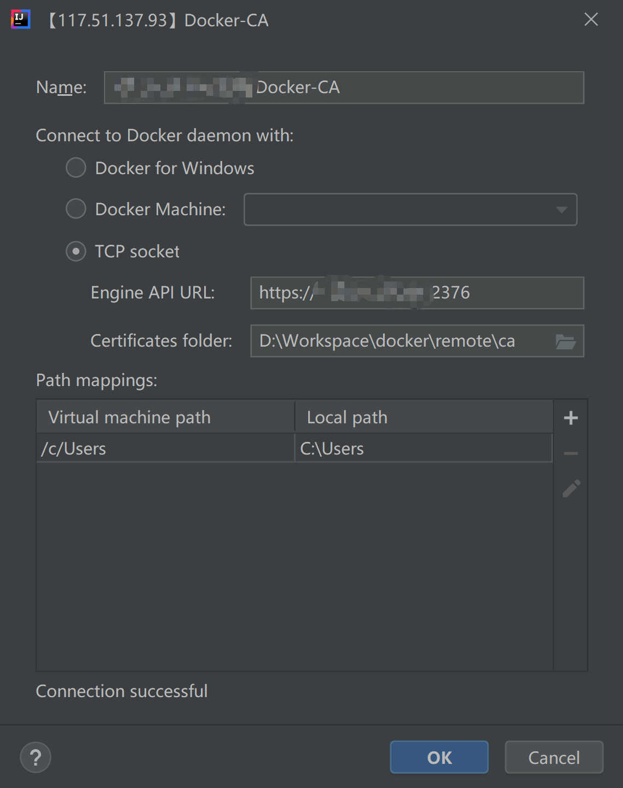

# Docker开启远程安全访问
<!-- TOC -->

- [Docker开启远程安全访问](#docker开启远程安全访问)
  - [Docker开启远程访问（非安全）](#docker开启远程访问非安全)
    - [编辑docker.service文件](#编辑dockerservice文件)
    - [找到ExecStart行，增加 `-H tcp://0.0.0.0:2376`](#找到execstart行增加--h-tcp00002376)
  - [重启Docker服务，使配置生效](#重启docker服务使配置生效)
    - [连接测试](#连接测试)
  - [Docker开启远程安全访问（保护 Docker 守护进程套接字）](#docker开启远程安全访问保护-docker-守护进程套接字)
    - [使用OpenSSL创建CA和服务端密钥key](#使用openssl创建ca和服务端密钥key)
      - [使用OpenSSL创建CA私钥](#使用openssl创建ca私钥)
      - [补全CA证书信息](#补全ca证书信息)
      - [生成服务器私钥server-key.pem和证书签名请求server-csr](#生成服务器私钥server-keypem和证书签名请求server-csr)
      - [编写扩展配置文件extfile.cnf](#编写扩展配置文件extfilecnf)
        - [将Docker守护程序密钥的扩展使用属性设置为仅用于服务器身份验证](#将docker守护程序密钥的扩展使用属性设置为仅用于服务器身份验证)
        - [填写服务端的信任列表](#填写服务端的信任列表)
      - [使用CA证书生成服务器签名证书server-cert.pem](#使用ca证书生成服务器签名证书server-certpem)
    - [利用CA创建客户端密钥key](#利用ca创建客户端密钥key)
      - [生成客户端私钥key.pem和证书签名请求client-csr](#生成客户端私钥keypem和证书签名请求client-csr)
      - [编写客户端证书扩展配置文件extfile.cnf](#编写客户端证书扩展配置文件extfilecnf)
      - [生成客户端签名文件cert.pem](#生成客户端签名文件certpem)
    - [删除不需要的文件，修改文件权限](#删除不需要的文件修改文件权限)
    - [启动Docker守护进程](#启动docker守护进程)
      - [方式一：指令启动](#方式一指令启动)
      - [方式二：修改daemon.json配置，启动](#方式二修改daemonjson配置启动)
      - [方式三：使用systemctl，修改docker.service文件](#方式三使用systemctl修改dockerservice文件)
      - [重新加载daemon并重启docker](#重新加载daemon并重启docker)
    - [验证远程连接](#验证远程连接)
      - [windows环境下验证远程连接](#windows环境下验证远程连接)
      - [linux环境下验证远程连接](#linux环境下验证远程连接)
  - [参考](#参考)

<!-- /TOC -->
## Docker开启远程访问（非安全）

### 编辑docker.service文件

```bash
vim /lib/systemd/system/docker.service
```

### 找到ExecStart行，增加 `-H tcp://0.0.0.0:2376`

```bash
[Service]
Type=notify
# the default is not to use systemd for cgroups because the delegate issues still
# exists and systemd currently does not support the cgroup feature set required
# for containers run by docker
ExecStart=/usr/bin/dockerd -H fd:// --containerd=/run/containerd/containerd.sock -H tcp://0.0.0.0:2376
# ExecStart=/usr/bin/dockerd -H tcp://0.0.0.0:2376 -H unix:///var/run/docker.sock
ExecReload=/bin/kill -s HUP $MAINPID
TimeoutSec=0
RestartSec=2
Restart=always
```

这里开放的是2376端口，可根据实际需要更改

## 重启Docker服务，使配置生效

```bash
sudo systemctl daemon-reload
sudo systemctl restart docker
```

### 连接测试

```bash
http://ip:2376/images/json
```

这里可以使用浏览器访问Docker远程访问地址，如果正常显示，则配置成功；如果无法访问，可以尝试开放2376端口。

## Docker开启远程安全访问（保护 Docker 守护进程套接字）

这样开启Docker远程访问却没有安全防护措施是十分危险的，正常情况需要配置安全防护。

官方文档中描述了如何配置保护措施，基于CA证书的加密方法：[Protect the Docker daemon socket](https://docs.docker.com/engine/security/https/#create-a-ca-server-and-client-keys-with-openss)

这里有三个角色，`Docker服务端`、`Docker客户端`、`CA签名的证书`

**Docker服务端**：对应运行Docker守护程序的主机

- 通过开放端口(一般为2376)支持远程连接
- 通过指定`tlsverify`标志并将Docker的tlscacert标志指向可信的CA证书来启用TLS以实现安全访问(仅允许由该CA签名的证书进行身份验证的客户端连接)

**Docker客户端**：即默认情况下的Docker主机

- 当使用证书连接时,仅能连接到具有该CA签名的证书的服务器

**CA签名的证书**：

- 服务端和客户端证书都只对应一份信任列表，信任列表里是服务端的信息(如ip或域名等等)
- 服务端持有服务端证书，仅接受持有客户端证书的主机访问(这里可以再加上其他的限制,详情见下文)

**注意**：

- Docker服务端也可以不开启TLS验证，不过这样子很不安全，生产环境下应当尽量避免。如果只是试验性的，可以指定关闭TLS验证，但只对特定主机开放。
- 如果Docker服务端没有开启TLS验证，则Docker客户端不需要使用证书连接。但如果客户端不使用证书连接开启了TLS验证的服务端，则会报错。
- 如果Docker客户端连接时使用的证书内不含目的主机的信息，则会提示对方主机不在证书信任列表内，访问失败。

**另外**：

- 以下示例中的所有`$HOST`实例替换为Docker守护程序主机的域名(DNS name)(由于没有配域名，这里用主机ip代替了)
- 以下步骤在**Docker服务端**进行

### 使用OpenSSL创建CA和服务端密钥key

#### 使用OpenSSL创建CA私钥

创建一个`ca`文件夹，用来存放CA证书

```bash
mkdir - p /opt/docker/ca
```

在Docker守护程序的主机上，生成CA私钥`ca-key.pem`：

```bash
cd /opt/docker/ca
openssl genrsa -aes256 -out ca-key.pem 4096
```

**说明**：

- 生成过程中需要输入密码并验证，后续步骤需要这个密码
- `ca-key.pem`是一个临时文件，最后可以删除

#### 补全CA证书信息

使用CA私钥生成自签名CA证书`ca.pem`，执行命令：

```bash
openssl req -new -x509 -days 365 -key ca-key.pem -sha256 -out ca.pem
```

说明：

- 生成证书时，通过`-days`设置证书的有效期，单位为天，默认情况下为30天。
- 有了CA证书后,就可以创建服务器密钥和证书签名请求（CSR）了

然后依次输入：访问密码、国家、省、市、组织名称、单位名称、随便一个名字、**通用名称**、邮箱。

至此，CA证书就创建完成了，有了CA之后，就可以创建服务器密钥和证书签名请求(CSR)了。

**注意**：确保**通用名称**与你连接Docker时使用的主机名相匹配。

官方示例如下：

```bash
#官方示例
$ openssl genrsa -aes256 -out ca-key.pem 4096
Generating RSA private key, 4096 bit long modulus
............................................................................................................................................................................................++
........++
e is 65537 (0x10001)
Enter pass phrase for ca-key.pem:
Verifying - Enter pass phrase for ca-key.pem:

$ openssl req -new -x509 -days 365 -key ca-key.pem -sha256 -out ca.pem
Enter pass phrase for ca-key.pem:
You are about to be asked to enter information that will be incorporated
into your certificate request.
What you are about to enter is what is called a Distinguished Name or a DN.
There are quite a few fields but you can leave some blank
For some fields there will be a default value,
If you enter '.', the field will be left blank.
-----
Country Name (2 letter code) [AU]:
State or Province Name (full name) [Some-State]:Queensland
Locality Name (eg, city) []:Brisbane
Organization Name (eg, company) [Internet Widgits Pty Ltd]:Docker Inc
Organizational Unit Name (eg, section) []:Sales
#重点，通用名称，要与你连接Docker时使用的主机名相匹配。
Common Name (e.g. server FQDN or YOUR name) []:$HOST
Email Address []:Sven@home.org.au
```

#### 生成服务器私钥server-key.pem和证书签名请求server-csr

生成服务器私钥server-key.pem

```bash
openssl genrsa -out server-key.pem 4096
```

由于可以通过IP地址和DNS名称建立TLS连接，因此在创建证书时需要指定IP地址。

```bash
openssl req -subj "/CN=$HOST" -sha256 -new -key server-key.pem -out server.csr
```

这里`$HOST`填写主机的IP地址

如果你是用的域名(比如:www.xxx.com)，则替换成对应域名即可

```bash
openssl req -subj "/CN=www.xxx.com" -sha256 -new -key server-key.pem -out server.csr
```

说明：

- CSR:Certificate Signing Request，证书签名请求
- server-csr是一个临时文件，生成server-cert.pem以后，可以删除。
- 这里指的ip或者是域名，都是指的将来用于对外的地址。

#### 编写扩展配置文件extfile.cnf

`extfile.cnf`文件用于指定下一步生成签名证书的一些属性配置，这里主要用到两个属性`subjectAltName`、`extendedKeyUsage`。

如果要其他要求(如限制指定ip范围的客户端才能连接)的可以看[OpenSSL x509v3_config文档](https://www.openssl.org/docs/manmaster/man5/x509v3_config.html)

**subjectAltName**：主题备选名称。

是有点像上一步生成server.csr时所用的选项 -subj "/CN=$HOST" 的东西，这个更像一个说明补充，这里可以填信任的DNS域名和主机IP等等。

另外，需要特别注意，这里对应生成的是一份信任列表，这里所说的信任是对服务端的信任，所以填的是服务端的信息(如域名、IP)。

我之前看到有文章说这里的列表是客户端的列表，只有在列表中的客户端才能访问服务器，这种说法是错误，在使用证书连接到服务器时，会报错说服务器IP不在信任列表中( 如远程主机ip为ip3，证书的信任列表为ip1和ip2时，若使用该证书访问远程主机，则会报错x509: certificate is valid for ip1, ip2, not ip3)

**extendedKeyUsage**：扩展密钥用法,此扩展包含一个用法列表，用于指示证书公钥可用于的目的

##### 将Docker守护程序密钥的扩展使用属性设置为仅用于服务器身份验证

```bash
echo extendedKeyUsage = serverAuth >> extfile.cnf
```

##### 填写服务端的信任列表

如果你对外docker的地址是ip地址，则命令如下

```bash
echo subjectAltName = DNS:$HOST,IP:127.0.0.1,IP:内网ip,IP:公网ip >> extfile.cnf
```

注意:

- 多个IP用逗号分隔
- 事实上只配一个公网IP就行了，其他的视实际需求而定，本机的话一般不那么麻烦，通过docker本身的配置即可使用本机控制。
- 这里配`127.0.0.1`主要是为了测试是否能连通，如果只配了内网地址则只有本局域网可访问,安全性更高。

#### 使用CA证书生成服务器签名证书server-cert.pem

```bash
openssl x509 -req -days 365 -sha256 -in server.csr -CA ca.pem -CAkey ca-key.pem \
  -CAcreateserial -out server-cert.pem -extfile extfile.cnf
```

执行后需要输入`创建CA私钥`过程中设置的密码。

至此，Docker服务端密钥创建完毕。

### 利用CA创建客户端密钥key

#### 生成客户端私钥key.pem和证书签名请求client-csr

```bash
openssl genrsa -out key.pem 4096

openssl req -subj '/CN=client' -new -key key.pem -out client.csr
```

#### 编写客户端证书扩展配置文件extfile.cnf

创建扩展配置文件：

```bash
#如果是在刚才创建服务器私钥的文件夹下，应该还有原来的extfile.cnf文件，为避免覆写，可以先执行重命名
mv extfile.cnf extfile.cnf.old

#使密钥适用于客户端身份验证
echo extendedKeyUsage = clientAuth >> extfile.cnf
```

#### 生成客户端签名文件cert.pem

```bash
openssl x509 -req -days 365 -sha256 -in client.csr -CA ca.pem -CAkey ca-key.pem \
  -CAcreateserial -out cert.pem -extfile extfile.cnf
```

生成`cert.pem`过程需要输入`创建CA私钥`过程中设置的密码。

### 删除不需要的文件，修改文件权限

生成`cert.pem`，`server-cert.pem`后，可以安全地删除两个证书签名请求和扩展配置文件：

```bash
rm -v client.csr server.csr extfile.cnf extfile.cnf.old
```

为了保护您的密钥免于意外损坏，请删除其写入权限。要使它们仅供您阅读，请按以下方式更改文件模式：

```bash
chmod -v 0400 ca-key.pem key.pem server-key.pem
```

证书可以使对外可读的，删除写入权限以防止意外损坏：

```bash
chmod -v 0444 ca.pem server-cert.pem cert.pem
```

### 启动Docker守护进程

#### 方式一：指令启动

```bash
dockerd  --tlsverify=true \
 --tlscacert=/opt/docker/ca/ca.pem  \
 --tlscert=/opt/docker/ca/server-cert.pem  \
 --tlskey=/opt/docker/ca/server-key.pem  \
 --host tcp://0.0.0.0:2376  \
 --host unix:///var/run/docker.sock
```

#### 方式二：修改daemon.json配置，启动

修改`/etc/docker/daemon.json`文件

```bash
vim /etc/docker/daemon.json

{
 "tlsverify": true,
  "tlscacert": "/opt/docker/ca/ca.pem",
  "tlscert": "/opt/docker/ca/server-cert.pem",
  "tlskey": "/opt/docker/ca/server-key.pem",
  "hosts": ["tcp://0.0.0.0:2376","unix:///var/run/docker.sock"],
  "registry-mirrors": [
  "https://dockerhub.azk8s.cn",
  "https://reg-mirror.qiniu.com",
  "https://registry.docker-cn.com"
  ]
}
```

修改后重启docker服务

```bash
sudo systemctl daemon-reload
sudo systemctl restart docker
```

如果在修改 /etc/docker/daemon.json后遇到启动失败的问题，如果json文件编写没有错误，可能是systemd的docker.service文件里面附带了与daemon.json文件重复的配置项。

```bash
vim /usr/lib/systemd/system/docker.service
```

一般情况systemctl启动`ExecStart`默认附带了参数 -H 用于指定监听，和 json文件里的 hosts 配置项重复，导致启动失败。

这里将其 `-H` 换行并添加屏蔽符号，也可直接删去。

#### 方式三：使用systemctl，修改docker.service文件

使Docker守护程序仅接收来自提供CA信任的证书的客户端的链接

```bash
vim /lib/systemd/system/docker.service
```

将 `ExecStart` 属性值进行替换

```bash
ExecStart=/usr/bin/dockerd --tlsverify --tlscacert=/opt/docker/ca/ca.pem --tlscert=/opt/docker/ca/server-cert.pem --tlskey=/opt/docker/ca/server-key.pem -H tcp://0.0.0.0:2376 -H unix:///var/run/docker.sock
```

#### 重新加载daemon并重启docker

```bash
sudo systemctl daemon-reload
sudo systemctl restart docker
```

### 验证远程连接

客户端需要的TLS文件有：

- ca.pem(CA证书)
- cert.pem(客户端证书)
- key.pem(客户端密钥)

#### windows环境下验证远程连接

使用浏览器访问`http://ip:2376/images/json`，如果不能访问了，则正常配置了。

这里验证下连接，使用IDEA中的Docker插件进行验证，直接配置链接显示连接失败



显然是无法连接了，此时我们需要去拿到之前Docker主机上创建TLS文件

```bash
ca.pem
cert.pem
key.pem
```

拉取这四个证书文件至本地文件夹，这个文件夹将用于在idea指定，需要说的是，TCP 里的链接需要改成 Https 格式。



连接成功。

#### linux环境下验证远程连接

这里我将TLS文件放在`/opt/docker/ca`目录下。

连接的指令格式如下，以docker version为例，其中`$HOST`为远程主机ip。

```bash
docker --tlsverify --tlscacert=/opt/docker/ca/ca.pem --tlscert=/opt/docker/ca/cert.pem --tlskey=/opt/docker/ca/key.pem -H=$HOST:2376 version
```


将version换成其他即可如在本机一样控制远程docker。

## 参考

- [Docker开启远程安全访问(这篇有点问题，不完全正确)](https://www.cnblogs.com/niceyoo/p/13270224.html)
- [Docker 守护进程+远程连接+安全访问+启动冲突解决办法 (完整收藏版)](https://blog.csdn.net/alinyua/article/details/81086124?utm_source=blogxgwz6)
