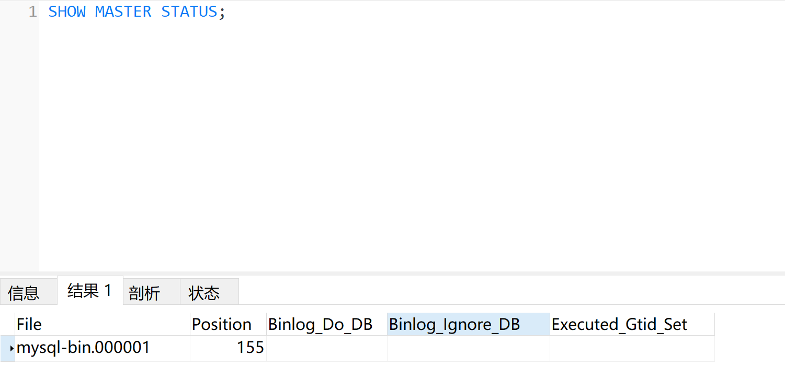

# Docker安装MySQL

官方Docker hub中的MySQL镜像地址：[MySQL镜像](https://hub.docker.com/_/mysql)

## 一、下载镜像

下载 MySQL 8.0.18 版本的镜像：

```bash
docker pull mysql:8.0.18
```

## 二、运行容器

创建一个文件夹存放MySQL配置文件、日志、数据等（挂载目录，作用是此目录中的文件或文件夹覆盖掉容器内部的文件或文件夹）

```bash
cd ~
mkdir mysql
cd mysql
mkdir data
```

启动MySQL容器

```bash
docker run -it -d -p 3306:3306 --name docker_mysql_8.0.18 -v "$PWD/data":/var/lib/mysql -e MYSQL_ROOT_PASSWORD=123456 mysql:8.0.18
```

启动容器命令解释：

> -d：后台启动
> -p：表示端口映射，冒号左面的是我们的宿主机的端口，也就是我们虚拟机的端口，而右侧则表示的是mysql容器内的端口
> --name：是我们给mysql容器取的名字
> -v：表示挂载路径，映射主机路径到容器，$PWD表示当前目录下，冒号左面的表示我们宿主机的挂载目录，也就是我们虚拟机所在的文件路径，冒号右边则表是的是mysql容器在容器内部的路径，上面的命令挂载了mysql数据存储目录
> -e 设置环境变量，这里设置了MySQL密码
> 最后是镜像名

除了以上的启动参数，启动docker中MySQL时还可以添加以下参数：

> --restart=always 跟随docker启动
> --privileged=true 容器root用户享有主机root用户权限
> --lower_case_table_names=1 设置表名参数名等忽略大小写

## 三、修改MySQL配置

进入容器：

```bash
docker exec -it docker_mysql_8.0.18 /bin/bash
```

进入到容器内后，使用mysql命令连接数据库

```bash
mysql -uroot -p
```

输入密码后，进入mysql命令行界面，开始设置远程的授权等信息

```sql
grant all privileges on *.* to root@"%" identified by "123456" with grant option;

#新版的的mysql版本已经将创建账户和赋予权限的方式分开了
#赋予权限:grant 权限列表 on 数据库 to '用户名'@'访问主机';(修改权限时在后面加with grant option)
#grant all privileges on *.* to root@"%" with grant option;

ALTER USER 'root'@'%' IDENTIFIED WITH mysql_native_password BY '123456';
ALTER USER 'root'@'localhost' IDENTIFIED WITH mysql_native_password BY '123456';
  
flush privileges;
```

## 四、主从配置

1.停止运行的MySQL容器：

```bash
docker stop docker_mysql_8.0.18
```

---

2.以docker_mysql_8.0.18为主库，创建MySQL主库、从库配置文件，从库数据目录

```bash
cd ~/mysql
touch docker_mysql_8.0.18.cnf
touch docker_mysql_8.0.18_slave.cnf
mkdir data_slave
```

docker_mysql_8.0.18.cnf信息如下：

```conf
# Copyright (c) 2017, Oracle and/or its affiliates. All rights reserved.
#
# This program is free software; you can redistribute it and/or modify
# it under the terms of the GNU General Public License as published by
# the Free Software Foundation; version 2 of the License.
#
# This program is distributed in the hope that it will be useful,
# but WITHOUT ANY WARRANTY; without even the implied warranty of
# MERCHANTABILITY or FITNESS FOR A PARTICULAR PURPOSE.  See the
# GNU General Public License for more details.
#
# You should have received a copy of the GNU General Public License
# along with this program; if not, write to the Free Software
# Foundation, Inc., 51 Franklin St, Fifth Floor, Boston, MA  02110-1301 USA

#
# The MySQL  Server configuration file.
#
# For explanations see
# http://dev.mysql.com/doc/mysql/en/server-system-variables.html

[mysqld]
pid-file        = /var/run/mysqld/mysqld.pid
socket          = /var/run/mysqld/mysqld.sock
datadir         = /var/lib/mysql
secure-file-priv= NULL
# Disabling symbolic-links is recommended to prevent assorted security risks
symbolic-links=0

# Custom config should go here
!includedir /etc/mysql/conf.d/

# 上面是默认配置，下面是自己的配置
server-id = 1
log-bin = mysql-bin
sql_mode=STRICT_TRANS_TABLES,NO_ENGINE_SUBSTITUTION
```

mkdir docker_mysql_8.0.18_slave.cnf信息如下：

```conf
# Copyright (c) 2017, Oracle and/or its affiliates. All rights reserved.
#
# This program is free software; you can redistribute it and/or modify
# it under the terms of the GNU General Public License as published by
# the Free Software Foundation; version 2 of the License.
#
# This program is distributed in the hope that it will be useful,
# but WITHOUT ANY WARRANTY; without even the implied warranty of
# MERCHANTABILITY or FITNESS FOR A PARTICULAR PURPOSE.  See the
# GNU General Public License for more details.
#
# You should have received a copy of the GNU General Public License
# along with this program; if not, write to the Free Software
# Foundation, Inc., 51 Franklin St, Fifth Floor, Boston, MA  02110-1301 USA

#
# The MySQL  Server configuration file.
#
# For explanations see
# http://dev.mysql.com/doc/mysql/en/server-system-variables.html

[mysqld]
pid-file        = /var/run/mysqld/mysqld.pid
socket          = /var/run/mysqld/mysqld.sock
datadir         = /var/lib/mysql
secure-file-priv= NULL
# Disabling symbolic-links is recommended to prevent assorted security risks
symbolic-links=0

# Custom config should go here
!includedir /etc/mysql/conf.d/

# 上面是默认配置，下面是自己的配置
server-id = 2
log-bin = mysql-bin
sql_mode=STRICT_TRANS_TABLES,NO_ENGINE_SUBSTITUTION
```

说明：server-id是唯一的，主从不能相同，server-id为1表示数据库为主数据库，server-id为2表示数据库为从数据库。

---

3.删除原有的docker_mysql_8.0.18容器，重新启动MySQL主库容器：

```bash
docker rm docker_mysql_8.0.18
cd ~/mysql
docker run --restart=always -it -d -p 3306:3306 --name docker_mysql_8.0.18 -v "$PWD/docker_mysql_8.0.18.cnf":/etc/my.cnf  -v "$PWD/data":/var/lib/mysql -e MYSQL_ROOT_PASSWORD=123456 mysql:8.0.18
```

---

4.启动MySQL从库容器：

```bash
cd ~/mysql
docker run --restart=always -it -d -p 3307:3306 --name docker_mysql_8.0.18_slave -v "$PWD/docker_mysql_8.0.18_slave.cnf":/etc/my.cnf  -v "$PWD/data_slave":/var/lib/mysql -e MYSQL_ROOT_PASSWORD=123456 mysql:8.0.18
```

命令说明：

>-v "$PWD/docker_mysql_8.0.18.cnf":/etc/my.cnf
>将宿主机mysql/目录下的mysql自定义配置文件docker_mysql_8.0.18.cnf挂载到mysql容器的/etc/my.cnf 文件上，相当于将docker_mysql_8.0.18.cnf配置文件的内容映射到mysql容器的/etc/my.cnf 文件上
>这样mysql容器启动时就不会加载/etc/mysql/下mysql默认的my.cnf配置文件，而去加载/etc/下的my.cnf配置文件，而自定义的docker_mysql_8.0.18.cnf配置文件中的内容就会生效。

**为何必须挂载到/etc/my.cnf 文件上，而不是/etc/mysql/my.cnf 文件上？**因为mysql默认配置文件位置在/etc/mysql/my.cnf，挂在方式无法改变容器中文件内容，my.conf内容不会改变，my.cnf中没有我们自定义的配置内容，启动mysql容器会报错。

>-v "$PWD/data":/var/lib/mysql
>该命令是将mysq容器中，mysql配置文件中指定的数据存储目录/var/lib/mysql下文件的内容共享到宿主机mysql/data目录下。

**为何必须挂载 /var/lib/mysql 目录？**有状态容器都有数据持久化需求，在容器的生命周期内，数据持久化是持续的，包括容器在被停止后，但当容器被删除后，数据也随之被删除了，因此Docker 采用 volume （卷）的形式来向容器提供持久化存储，如果不设置该命令，数据库中的数据会默认保存在mysql容器中的/var/lib/mysql目录下，这样当执行 docker rm 容器id/容器name 命令，会丢失数据库中的数据。

5.设置远程连接，同【三、修改MySQL配置】。

6.主库上，执行查询sql: SHOW MASTER STATUS ，保留查询出的信息，例：这里我查询出的信息如下：



7.从库上，执行查询sql: STOP SLAVE ，停止slave。

8.从库上，配置主库连接，使用root用户，执行查询sql:

```sql
CHANGE MASTER TO MASTER_HOST='10.255.20.23',MASTER_PORT=3306,MASTER_USER='root',MASTER_PASSWORD='123456',MASTER_LOG_FILE='mysql-bin.000001',MASTER_LOG_POS=155;
```

注意：这里sql中的主库信息要与主库上查询出的信息一致。

9.从库上，执行查询sql: START SLAVE ，启动slave。

10.从库上，执行查询sql: SHOW SLAVE STATUS ，查看slave状态，Slave_IO_State的值为Waiting for master to send event，则说明配置成功。

11.从库配置过程中报错，执行sql：RESET SLAVE。

## 五、参考

- [Docker实现Mysql8主从配置](https://www.jianshu.com/p/0a909c39a381)
