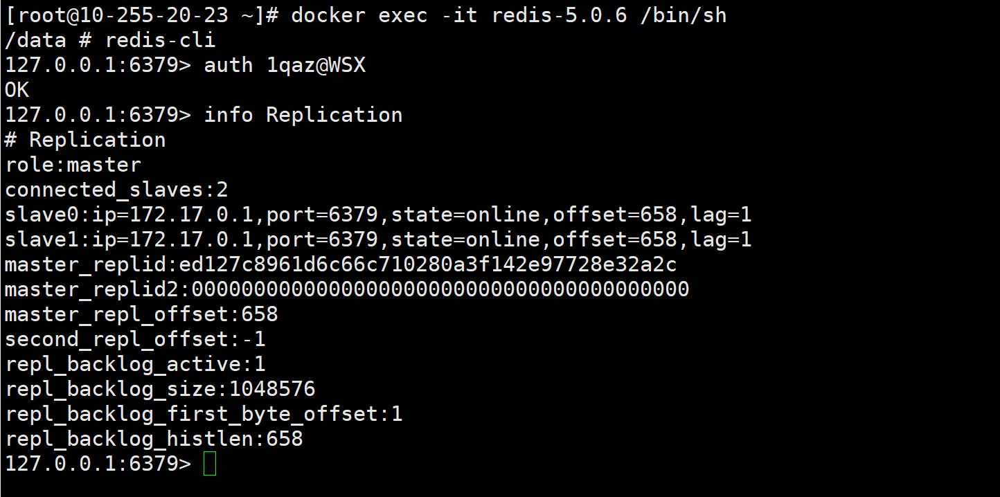
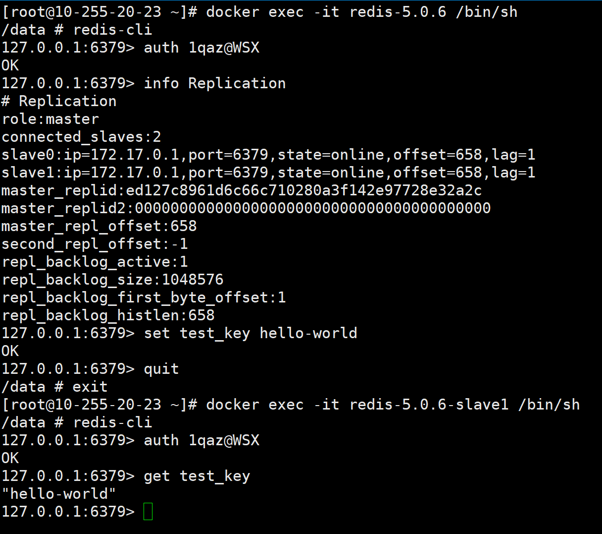

# Docker安装Redis

官方Docker hub中的redis镜像地址：[redis镜像](https://hub.docker.com/_/redis)

## 一、下载镜像

下载 redis 5.0.6 版本的镜像：

```bash
docker pull redis:5.0.6-alpine3.10
```

## 二、运行容器

0.为Docker容器指定自定义网段的固定IP/静态IP地址

第一步：创建自定义网络
备注：这里选取了172.172.0.0网段，也可以指定其他任意空闲的网段

```bash
docker network create --subnet=172.172.0.0/16 docker-ice
```

注：docker-ice为自定义网桥的名字，可自己任意取名。

第二步：在你自定义的网段选取任意IP地址作为你要启动的container的静态IP地址
备注：这里在第二步中创建的网段中选取了172.172.0.10作为静态IP地址。
这里以启动docker-ice为例。
docker run -d --net docker-ice --ip 172.172.0.10 ubuntu:16.04

备注：

- 这里是固定IP地址的一个应用场景的延续，仅作记录用，可忽略不看。
- 如果需要将指定IP地址的容器出去的请求的源地址改为宿主机上的其他可路由IP地址，可用iptables来实现。比如将静态IP地址 172.18.0.10出去的请求的源地址改成公网IP104.232.36.109(前提是本机存在这个IP地址)，可执行如下命令：

```bash
iptables -t nat -I POSTROUTING -o eth0 -d  0.0.0.0/0 -s 172.18.0.10  -j SNAT --to-source 104.232.36.109
```

这里创建一个自定义网络，用于指定redis的IP地址：

```bash
docker network create --subnet=172.172.0.0/16 subnet-redis
```

1.获取并修改redis配置文件

redis官方提供了一个配置文件样例，通过wget工具下载下来。

```bash
cd ~
mkdir redis
cd redis
wget http://download.redis.io/redis-stable/redis.conf
#备个份
cp redis.conf redis.conf-back
#创建挂载redis数据存储目录
mkdir data
```

修改配置

```conf
# 注释这一行，表示Redis可以接受任意ip的连接
# bind 127.0.0.1

# 关闭保护模式
protected-mode no

# 让redis服务后台运行。如果 docker run 命令中使用 -d ，则已经表示后台启动，故不需要修改
# daemonize yes

# 去掉注释，设定密码
requirepass password

#配置日志路径，为了便于排查问题，指定redis的日志文件目录
logfile "redis.log"

#开启数据持久化
appendonly yes
```

2.启动redis容器

```bash
cd ~
docker run -d  -it -p 6379:6379 --name redis-5.0.6 --net subnet-redis --ip 172.172.0.2 -v $PWD/redis/redis.conf:/etc/redis/redis.conf -v $PWD/redis/data:/data redis:5.0.6-alpine3.10 redis-server /etc/redis/redis.conf
```

命令说明：

- -d：后台启动
- -p 6379:6379 : 将容器的6379端口映射到主机的6379端口
- -v $PWD/data:/data : 将主机中当前目录下的data挂载到容器的/data
- redis-server : 在容器执行redis-server启动命令
- --net : 指定网段
- --ip : 指定容器的静态IP

**特别注意**：`docker run`中的启动参数`-d`已经表示后台启动，无需修改redis.conf中的`daemonize yes`，这两者冲突，同时存在会导致无法启动，日志也没有错误信息。

3.进入redis容器

```bash
#这里没有用bash，因为镜像不适合bash操作
docker exec -it redis-5.0.6 /bin/sh
```

3.进入容器内后，使用redis-cli连接redis服务

```bash
# redis-cli -p 6379 -a foobared
$ redis-cli
127.0.0.1:6379> ping
PONG
127.0.0.1:6379> auth password
```

## 三、主从配置

1.新建master和slave角色的redis配置文件

```bash
cd ~/redis/
cp redis.conf redis-slave1.conf
cp redis.conf redis-slave2.conf
mkdir data_slave1
mkdir data_slave2
```

这边不重新启动一个新的，以上面的redis-5.0.6容器为redis master，master配置文件修改同上。

slave配置文件修改如下：

```conf
# 注释这一行，表示Redis可以接受任意ip的连接
# bind 127.0.0.1

# 关闭保护模式
protected-mode no

# 让redis服务后台运行。如果 docker run 命令中使用 -d ，则已经表示后台启动，故不需要修改
# daemonize yes

# 设定密码(可选，如果这里开启了密码要求，slave的配置里就要加这个密码)
requirepass password

#配置日志路径，为了便于排查问题，指定redis的日志文件目录
logfile "redis.log"

#开启数据持久化
appendonly yes

# 设定主库的密码，用于认证，如果主库开启了requirepass选项这里就必须填相应的密码
masterauth <master-password>

# 设定master的IP和端口号，redis配置文件中的默认端口号是6379
# 低版本的redis这里会是slaveof，意思是一样的，因为slave是比较敏感的词汇，所以在redis后面的版本中不在使用slave的概念，取而代之的是replica
replicaof 172.172.0.2 6379
```

2.之前运行的redis容器作为master，再启动两个slave redis容器：

这里启动顺序有要求，master要早于slave启动。

```bash
cd ~
docker run -d -it --net subnet-redis --ip 172.172.0.3 -p 6389:6379 --name redis-5.0.6-slave1 -v $PWD/redis/redis-slave1.conf:/etc/redis/redis.conf -v $PWD/redis/data_slave1:/data redis:5.0.6-alpine3.10 redis-server /etc/redis/redis.conf
docker run -d -it --net subnet-redis --ip 172.172.0.4 -p 6399:6379 --name redis-5.0.6-slave2 -v $PWD/redis/redis-slave2.conf:/etc/redis/redis.conf -v $PWD/redis/data_slave2:/data redis:5.0.6-alpine3.10 redis-server /etc/redis/redis.conf
```

3.启动成功后，进入容器中查看主从配置是否成功

进入redis-5.0.6容器：

```bash
docker exec -it redis-5.0.6 /bin/sh

#进入容器后
redis-cli
127.0.0.1:6379> auth password
127.0.0.1:6379> info Replication

# Replication
role:master
connected_slaves:2
slave0:ip=172.172.0.3,port=6379,state=online,offset=266,lag=0
slave1:ip=172.172.0.4,port=6379,state=online,offset=266,lag=0
master_replid:0c54aa8aeaa1a0ab5e48e6e8a1a3a91fc456d048
master_replid2:0000000000000000000000000000000000000000
master_repl_offset:266
second_repl_offset:-1
repl_backlog_active:1
repl_backlog_size:1048576
repl_backlog_first_byte_offset:1
repl_backlog_histlen:266
```



可以看到主从已经配置成功。

4.验证主从复制

在master上写入一个key-value值，查看是否会同步到slave上，来验证主从同步是否能成功。

```bash
127.0.0.1:6379> set test_key hello-world
ok
```

在slave中查看这个key，看是否数据同步：

```bash
docker exec -it redis-5.0.6-slave1 /bin/sh
redis-cli
127.0.0.1:6379> auth password
127.0.0.1:6379> get test_key
"hello-world"
```



主从配置成功。

## 主从添加哨兵

Redis-Sentinel是官方推荐的高可用（HA）解决方案，本身也是一个独立运行的进程。redis的sentinel系统用于管理多个redis服务器实例（instance）。
哨兵适用于非集群结构的redis环境，比如：redis主从环境。在redis集群中，节点担当了哨兵的功能，所以redis集群不需要考虑sentinel。
为防止单点故障，可对sentinel进行集群化。其主要功能如下：

- 监控：sentinel不断的检查master和slave的活性；
- 通知：当发现redis节点故障，可通过API发出通知；
- 自动故障转移：当一个master节点故障时，能够从众多slave中选举一个作为新的master，同时其它slave节点也将自动将所追随的master的地址改为新master的地址；
- 配置提供者：哨兵作为redis客户端发现的权威来源：客户端连接到哨兵请求当前可靠的master地址，若发生故障，哨兵将报告新地址。

下面是哨兵的配置流程：

1.获取并修改sentinel配置文件，用于参考

```bash
cd ~/redis/
wget http://download.redis.io/redis-stable/sentinel.conf
mv sentinel.conf sentinel.conf-back
touch sentinel.conf
mkdir data_sentinel
mkdir data_sentinel_slave1
mkdir data_sentinel_slave2
```

2.修改sentinel配置文件

```conf
protected-mode no

# 让sentinel服务后台运行。同样，如果 docker run 命令中使用 -d ，则已经表示后台启动，故不需要修改
# daemonize yes

# 修改日志文件的路径
logfile "sentinel.log"

# 修改监控的主redis服务器
# 这个主服务器标记为失效至少需要2个哨兵进程的同意
sentinel monitor mymaster1 172.172.0.2 6379 2

# 用于认证，如果主库开启了requirepass选项这里就必须填相应的密码
# 特别注意：这一行要放在sentinel monitor下面，否则会找不到主机：No such master with specified name
sentinel auth-pass mymaster1 <master-password>

sentinel down-after-milliseconds mymaster1 10000
sentinel parallel-syncs mymaster1 1
sentinel failover-timeout mymaster1 15000

#redis slave1
sentinel monitor mymaster2 172.172.0.3 6379 2
sentinel auth-pass mymaster2 <slave1-password>
sentinel down-after-milliseconds mymaster2 10000
sentinel parallel-syncs mymaster2 1
sentinel failover-timeout mymaster2 15000

#redis slave2
sentinel monitor mymaster3 172.172.0.4 6379 2
sentinel auth-pass mymaster3 <slave2-password>
sentinel down-after-milliseconds mymaster3 10000
sentinel parallel-syncs mymaster3 1
sentinel failover-timeout mymaster3 15000
```

3.启动sentinel容器

```bash
cd ~
docker run -d  -it -p 26379:26379 --name redis-sentinel --net subnet-redis --ip 172.172.0.12 -v $PWD/redis/sentinel.conf:/usr/local/etc/redis/sentinel.conf -v $PWD/redis/data_sentinel:/data redis:5.0.6-alpine3.10 redis-sentinel /usr/local/etc/redis/sentinel.conf
docker run -d  -it -p 26389:26379 --name redis-sentinel-slave1 --net subnet-redis --ip 172.172.0.13 -v $PWD/redis/sentinel-slave1.conf:/usr/local/etc/redis/sentinel.conf -v $PWD/redis/data_sentinel_slave1:/data redis:5.0.6-alpine3.10 redis-sentinel /usr/local/etc/redis/sentinel.conf
docker run -d  -it -p 26399:26379 --name redis-sentinel-slave2 --net subnet-redis --ip 172.172.0.14 -v $PWD/redis/sentinel-slave2.conf:/usr/local/etc/redis/sentinel.conf -v $PWD/redis/data_sentinel_slave2:/data redis:5.0.6-alpine3.10 redis-sentinel /usr/local/etc/redis/sentinel.conf
```

4.查看日志，哨兵成功监听到一主和两从的机器

```bash
docker exec -it redis-sentinel /bin/sh
redis-cli -p 26379
127.0.0.1:26379> info Sentinel
# Sentinel
sentinel_masters:3
sentinel_tilt:0
sentinel_running_scripts:0
sentinel_scripts_queue_length:0
sentinel_simulate_failure_flags:0
master0:name=mymaster3,status=odown,address=172.172.0.4:6379,slaves=0,sentinels=3
master1:name=mymaster2,status=odown,address=172.172.0.3:6379,slaves=0,sentinels=3
master2:name=mymaster1,status=ok,address=172.172.0.2:6379,slaves=2,sentinels=3
```

哨兵配置成功。

5.验证failover(故障转移)

为了验证自动主从切换，这里停掉master的容器：

```bash
docker stop redis-5.0.6
```

停止后，查看sentinel日志：

```log
1:X 21 Nov 2019 09:14:36.536 # +elected-leader master mymaster1 172.172.0.2 6379
1:X 21 Nov 2019 09:14:36.536 # +failover-state-select-slave master mymaster1 172.172.0.2 6379
1:X 21 Nov 2019 09:14:36.603 # +selected-slave slave 172.172.0.3:6379 172.172.0.3 6379 @ mymaster1 172.172.0.2 6379
1:X 21 Nov 2019 09:14:36.603 * +failover-state-send-slaveof-noone slave 172.172.0.3:6379 172.172.0.3 6379 @ mymaster1 172.172.0.2 6379
1:X 21 Nov 2019 09:14:36.655 * +failover-state-wait-promotion slave 172.172.0.3:6379 172.172.0.3 6379 @ mymaster1 172.172.0.2 6379
1:X 21 Nov 2019 09:14:36.899 # +promoted-slave slave 172.172.0.3:6379 172.172.0.3 6379 @ mymaster1 172.172.0.2 6379
1:X 21 Nov 2019 09:14:36.899 # +failover-state-reconf-slaves master mymaster1 172.172.0.2 6379
1:X 21 Nov 2019 09:14:36.994 * +slave-reconf-sent slave 172.172.0.4:6379 172.172.0.4 6379 @ mymaster1 172.172.0.2 6379
1:X 21 Nov 2019 09:14:37.611 # -odown master mymaster1 172.172.0.2 6379
1:X 21 Nov 2019 09:14:37.909 * +slave-reconf-inprog slave 172.172.0.4:6379 172.172.0.4 6379 @ mymaster1 172.172.0.2 6379
1:X 21 Nov 2019 09:14:37.909 * +slave-reconf-done slave 172.172.0.4:6379 172.172.0.4 6379 @ mymaster1 172.172.0.2 6379
1:X 21 Nov 2019 09:14:37.960 # +failover-end master mymaster1 172.172.0.2 6379
1:X 21 Nov 2019 09:14:37.961 # +switch-master mymaster1 172.172.0.2 6379 172.172.0.3 6379
1:X 21 Nov 2019 09:14:37.961 * +slave slave 172.172.0.4:6379 172.172.0.4 6379 @ mymaster1 172.172.0.3 6379
1:X 21 Nov 2019 09:14:37.961 * +slave slave 172.172.0.2:6379 172.172.0.2 6379 @ mymaster1 172.172.0.3 6379
1:X 21 Nov 2019 09:14:42.716 * +slave slave 172.172.0.4:6379 172.172.0.4 6379 @ mymaster2 172.172.0.3 6379
1:X 21 Nov 2019 09:14:42.815 # -sdown master mymaster2 172.172.0.3 6379
1:X 21 Nov 2019 09:14:42.815 # -odown master mymaster2 172.172.0.3 6379
1:X 21 Nov 2019 09:14:48.009 # +sdown slave 172.172.0.2:6379 172.172.0.2 6379 @ mymaster1 172.172.0.3 6379
1:X 21 Nov 2019 09:15:05.828 # +new-epoch 30
1:X 21 Nov 2019 09:15:05.833 # +vote-for-leader 55c5b4c0467869610be7b48cf5be1d45643fc293 30
1:X 21 Nov 2019 09:15:05.889 # Next failover delay: I will not start a failover before Thu Nov 21 09:15:35 2019
1:X 21 Nov 2019 09:15:35.910 # +new-epoch 31
1:X 21 Nov 2019 09:15:35.910 # +try-failover master mymaster3 172.172.0.4 6379
1:X 21 Nov 2019 09:15:35.914 # +vote-for-leader 351a571268a60feeb5bf36cc1ec0b4d3b1c0b998 31
1:X 21 Nov 2019 09:15:35.924 # cecee36de2599d43e1a4ef6f8bda62ea4d1408f5 voted for 351a571268a60feeb5bf36cc1ec0b4d3b1c0b998 31
1:X 21 Nov 2019 09:15:35.924 # 55c5b4c0467869610be7b48cf5be1d45643fc293 voted for 351a571268a60feeb5bf36cc1ec0b4d3b1c0b998 31
1:X 21 Nov 2019 09:15:35.998 # +elected-leader master mymaster3 172.172.0.4 6379
1:X 21 Nov 2019 09:15:35.998 # +failover-state-select-slave master mymaster3 172.172.0.4 6379
1:X 21 Nov 2019 09:15:36.053 # -failover-abort-no-good-slave master mymaster3 172.172.0.4 6379
```

这段日志显示，master从`172.172.0.2 6379`切换到`172.172.0.3 6379`，到slave1容器查看是否角色是master：

```bash
docker exec -it redis-5.0.6-slave1 /bin/sh
redis-cli -p 26379
127.0.0.1:26379> info Replication
# Replication
role:master
connected_slaves:1
slave0:ip=172.172.0.4,port=6379,state=online,offset=318945,lag=1
master_replid:b94ca704b808e91905a3a8d656415ab6fbff5fd2
master_replid2:9b96032d2a7a6de4e6d8682a49cd2d4a8c7f84c5
master_repl_offset:319085
second_repl_offset:110142
repl_backlog_active:1
repl_backlog_size:1048576
repl_backlog_first_byte_offset:1
repl_backlog_histlen:319085
```

## redis集群配置

官方文档：[Redis集群教程](https://redis.io/topics/cluster-tutorial)

1.在redis目录新建`redis-cluster`文件夹，创建 `redis-cluster.tmpl` 文件：

```bash
cd ~/redis/
mkdir redis-cluster
touch redis-cluster.tmpl
```

文件内容如下：

```conf
port ${PORT}
protected-mode no
cluster-enabled yes
cluster-config-file nodes.conf
cluster-node-timeout 5000
cluster-announce-ip ${IP}
cluster-announce-port ${PORT}
cluster-announce-bus-port 1${PORT}
appendonly yes
#集群加密
masterauth password
requirepass password
```

配置说明：

- port（端口号）
- cluster-enabled yes（启动集群模式）
- cluster-config-file nodes.conf（集群节点信息文件）
- cluster-node-timeout 5000（redis节点宕机被发现的时间）
- cluster-announce-ip（集群节点的汇报ip，防止nat，预先填写为网关ip后续需要手动修改配置文件）
- cluster-announce-port（集群节点的汇报port，防止nat）
- cluster-announce-bus-port（集群节点的汇报bus-port，防止nat）
- appendonly yes（开启aof）
- masterauth（设置集群节点间访问密码，跟下面一致）
- requirepass（设置redis访问密码）

2.在redis-cluster下生成conf和data目标，并生成配置信息：

```bash
cd ~/redis/redis-cluster
for index in `seq 1 6`; do \
  mkdir -p ./700${index}/conf \
  && IP=10.255.20.23 PORT=700${index} envsubst < ./redis-cluster.tmpl > ./700${index}/conf/redis.conf \
  && mkdir -p ./700${index}/data; \
done
```

共生成6个文件夹，从7001到7006，每个文件夹下包含data和conf文件夹，同时conf里面有redis.conf配置文件。

3.创建6个redis容器

```bash
cd ~/redis/redis-cluster
for index in `seq 1 6`; do \
  docker run \
  -d -it \
  --net host \
  -p 700${index}:700${index} \
  --name redis-5.0.6-cluster-700${index} \
  -v $PWD/700${index}/conf/redis.conf:/usr/local/etc/redis/redis.conf \
  -v $PWD/700${index}/data:/data \
  --restart always \
  --sysctl net.core.somaxconn=1024 \
  redis:5.0.6-alpine3.10 redis-server /usr/local/etc/redis/redis.conf; \
done
```

4.随便进入一个已运行的redis容器

```bash
docker exec -it redis-5.0.6-cluster-7001 /bin/sh
```

5.在redis容器中执行集群命令

```bash
redis-cli --cluster create \
10.255.20.23:7001 \
10.255.20.23:7002 \
10.255.20.23:7003 \
10.255.20.23:7004 \
10.255.20.23:7005 \
10.255.20.23:7006 \
-a wangzhihao1994 \
--cluster-replicas 1
```

命令说明：

- --replicas  1  表示 自动为每一个master节点分配一个slave节点

6.检查集群配置

```bash
redis-cli -a password --cluster check 10.255.20.23:7001

[OK] All nodes agree about slots configuration.
>>> Check for open slots...
>>> Check slots coverage...
[OK] All 16384 slots covered.
```

验证成功。

7.集群能被外网访问。

方式一（不行）：修改data/nodes.conf文件中的ip地址为公网地址。经测试，不行，redis连的上，但库连不上。

所以采用的方式是：将上述部署redis集群的IP从内网IP修改为公网IP。

## 参考

- [基于Docker搭建Redis一主两从三哨兵]([基于Docker搭建Redis一主两从三哨兵](https://www.jianshu.com/p/205d4eee88b0))
- [极简 docker 环境 redis 5 安装 redis-cluster 集群（不需要Ruby）](https://blog.csdn.net/adolph586/article/details/85340764)
- [Docker Compose 部署 Redis 及原理讲解](https://kany.me/2019/10/16/docker-compose-redis/)
