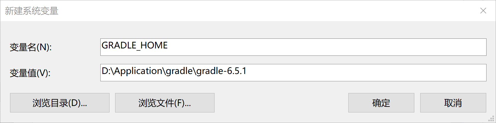

# Windows环境使用Gradle

Gradle官网:[官网](https://gradle.org/)

## 介绍

Gradle是一个基于Apache Ant和Apache Maven概念的项目自动化构建开源工具。它使用一种基于Groovy的特定领域语言(DSL)来声明项目设置，目前也增加了基于Kotlin语言的kotlin-based DSL，抛弃了基于XML的各种繁琐配置。

Gradle面向Java应用为主。当前其支持的语言限于Java、Groovy、Kotlin和Scala，计划未来将支持更多的语言。

Gradle是一个基于JVM的构建工具，是一款通用灵活的构建工具，支持maven， Ivy仓库，支持传递性依赖管理，而不需要远程仓库或者是pom.xml和ivy.xml配置文件，基于Groovy，build脚本使用Groovy编写。

## 功能

- gradle对多工程的构建支持很出色，工程依赖是gradle的第一功能。
- gradle支持局部构建。
- 支持多方式依赖管理：包括从maven远程仓库、nexus私服、ivy仓库以及本地文件系统的jars或者dirs
- gradle是第一个构建集成工具，与ant、maven、ivy有良好的相容相关性。
- 轻松迁移：gradle适用于任何结构的工程，你可以在同一个开发平台平行构建原工程和gradle工程。通常要求写相关测试，以保证开发的插件的相似性，这种迁移可以减少破坏性，尽可能的可靠。这也是重构的最佳实践。
- gradle的整体设计是以作为一种语言为导向的，而非成为一个严格死板的框架。
- 免费开源

##　安装及环境配置

Gradle下载地址:[下载地址](https://services.gradle.org/distributions/)

选择对应的版本下载即可,这里我选择的是`gradle-6.5.1-bin.zip`

下载后解压到你想要的目录即可，然后新建系统环境`GRADLE_HOME`再找到path变量，后面添加`%GRADLE_HOME%\bin`。




命令行中输入`gradle -v`，正常输出版本信息，则配置成功


## 构建命令

清理命令：

```bash
gradle clean
```

构建打包命令：

```bash
gradle clean build
```

编译时跳过测试，使用`-x`，`-x`参数用来排除不需要执行的任务：

```bash
gradle clean build -x test
```

## Gradle中配置内网仓库或者国内源加速下载

### 在当前项目的gradle配置中增加其他源，只对当前项目有效

```groovy
// 阿里云 maven 服务，阿里云的maven服务应该算是比较靠谱的了吧
def MAVEN_ALIYUN = 'http://maven.aliyun.com/nexus/content/groups/public'

buildscript {
    repositories {
        jcenter()
        maven {
            url MAVEN_ALIYUN
        }
    }
    dependencies {
        classpath 'com.android.tools.build:gradle:2.3.2'
    }
}

allprojects {
    repositories {
        jcenter()
        maven {
            url MAVEN_ALIYUN
        }
    }
}
```

### 使用gradle全局配置(推荐)

在不改变原有项目代码的情况下，使用全局gradle初始化脚本配置来修改一些属性最合适不过了。

将init.gradle文件放到.gradle目录下(或者指定的gradle user home)使用即可，不用跟随gradle版本不同而改动，如果是放到具体某个gradle版本的init.d目录下则每个版本都要放一次。

默认情况：

```properties
unix用户 ： ~/.gradle
windows用户： C:\Users\XXUser\.gradle
```

`init.gradle`具体内容如下，还可以做一些其他的功能

```groovy
// 内网部署的 Maven
def NEXUS_SERVER = "http://nexus.company.com/content/groups/public"
def NEXUS_USERNAME = "username"
def NEXUS_PASSWORD = "password"

// 阿里云 maven 服务
def MAVEN_ALIYUN = 'http://maven.aliyun.com/nexus/content/groups/public'

allprojects {
    buildscript {
        repositories {
            maven {
                // 需要账号密码认证的maven服务
                credentials {
                    username NEXUS_USERNAME
                    password NEXUS_PASSWORD
                }
                url NEXUS_SERVER
            }

            maven {
                url MAVEN_ALIYUN
            }

            jcenter()
        }
    }

    repositories {
        maven {
            credentials {
                username NEXUS_USERNAME
                password NEXUS_PASSWORD
            }
            url NEXUS_SERVER
        }

        maven {
            url MAVEN_ALIYUN
        }

        jcenter()
    }
}
```

### 移除jcenter,用其他源替代，简单粗暴

```groovy
allprojects{
    repositories {
        def REPOSITORY_URL = 'http://maven.aliyun.com/nexus/content/groups/public'
        all { ArtifactRepository repo ->
            if(repo instanceof MavenArtifactRepository){
                def url = repo.url.toString()
                if (url.startsWith('https://repo1.maven.org/maven2') || url.startsWith('https://jcenter.bintray.com/')) {
                    project.logger.lifecycle "Repository ${repo.url} replaced by $REPOSITORY_URL."
                    remove repo
                }
            }
        }
        maven {
            url REPOSITORY_URL
        }
    }
}
```
