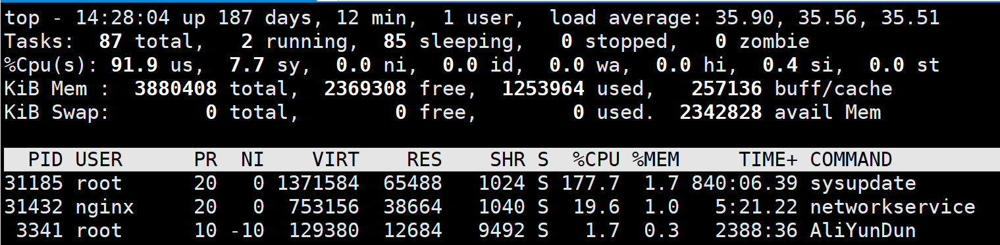
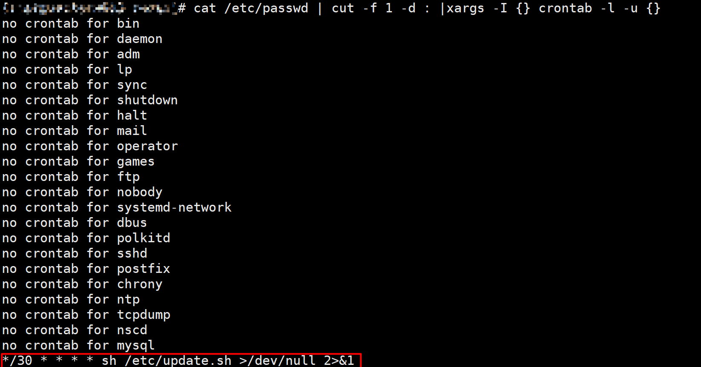

# 记一次阿里云服务器被植入挖矿程序

## 问题

有一天阿里云一直提示安全警告，打开一看，提示有挖矿程序。赶紧连上阿里云服务器使用top命令看一下情况：



很明显，罪魁祸首就是这个 `sysupdate` 和 `networkservice` ，百度看了一下，果然是挖矿程序，问题出在 `/etc` 目录下的sysupdate、networkservice 、sysguard、update.sh上。

**Redis没有设置密码，利用其漏洞植入挖矿程序**：

看了下服务器上的程序，redis没有设置密码，果然，看了下redis库中有个key为1，值为定时访问某资源的curl命令。

**查看crontab任务**：

Linux crontab 查看所有用户的crontab任务，以root用户执行：

```bash
cat /etc/passwd | cut -f 1 -d : |xargs -I {} crontab -l -u {}
```

查看了下定时任务：



## 处理

根据前人经验：[记录一次清除Linux挖矿病毒的经历(sysupdate, networkservice进程)](https://blog.csdn.net/daiyuhe/article/details/95683393)

1.关闭定时任务

```bash
cd /var/spool/cron/
rm * #删除所有的定时任务
```

2.关闭sysupdate、networkservice、sysguard进程

```bash
kill -9 $PID #进程id
```

3.删除`/etc`目录下sysupdate、networkservice、sysguard、update.sh、config.json。

直接删除sysupdate你会发现无法删除，因为一般病毒会使用chattr +i命令，我们使用chattr -i sysupdate，然后再 rm -f sysupdate 即可正常删除。

4.`/root/.ssh/authorized_keys` 删除或修复

**如果你被攻破的是root用户(或者被攻破的用户权限较大),你可能还需要**:

**注意**：修复SELinux这一步不需要，阿里云服务器修改后，会导致无法ssh登录服务器。

1.修复SELinux

病毒脚本首先就会尝试关闭SELinux子系统，我们可以使用getenforce命令查看SELinux状态。
如果你想要重新打开，可以修改/etc/selinux/config文件将SELINUX=disabled改为SELINUX=enforcing，然后重新启动服务器。

2.wget命令和curl命令会被改为wge和cur，这样用着很变扭，改回来

```bash
mv /bin/wge /bin/wget
mv /bin/cur /bin/curl
mv /usr/bin/wge /usr/bin/wget
mv /usr/bin/cur /usr/bin/curl
```

3.恢复防火墙配置

这里给出病毒脚本修改的iptables配置的语句，方便读者修复

```bash
iptables -F
iptables -X
iptables -A OUTPUT -p tcp --dport 3333 -j DROP
iptables -A OUTPUT -p tcp --dport 5555 -j DROP
iptables -A OUTPUT -p tcp --dport 7777 -j DROP
iptables -A OUTPUT -p tcp --dport 9999 -j DROP
iptables -I INPUT -s 43.245.222.57 -j DROP
service iptables reload
```
