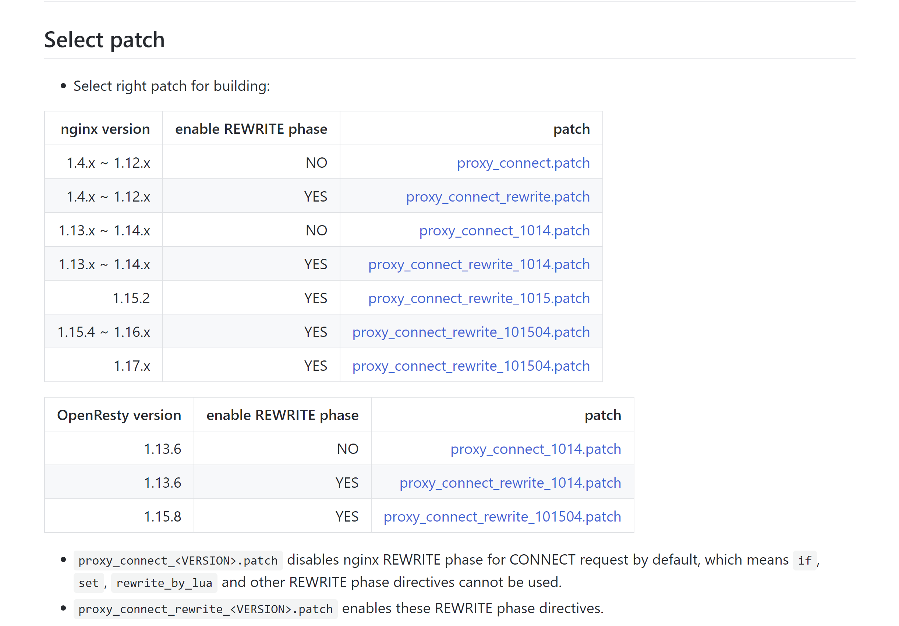

# Nginx支持正向代理http和https

默认的情况下，使用nginx做正向代理可以解析http请求，但不支持https请求。

借助第三方模块[ngx_http_proxy_connect_module](https://github.com/chobits/ngx_http_proxy_connect_module)实现代理https请求。

## 安装编译工具、库文件

首先确保安装了patch，gcc、gcc++、pcre、zlib，这些编译时需要用到的依赖软件或静态库。

``` bash
yum group install -y "Development Tools"
yum install -y patch pcre-devel pcre zlib-devel zlib
```

## 下载模块

下载[ngx_http_proxy_connect_module](https://github.com/chobits/ngx_http_proxy_connect_module)第三方模块

``` bash
cd /opt
git clone https://github.com/chobits/ngx_http_proxy_connect_module
```

## 编译安装nginx

patch -p1 < {当前nginx版本对应proxy_connect.patch路径}，其他版本可查看模块主页上的文档找到对应版本的patch



``` bash
cd nginx-1.16.0/
# patch -p1 < {当前nginx版本对应proxy_connect.patch路径}，其他版本可查看模块主页上的文档找到对应版本的patch
patch -p1 < /opt/ngx_http_proxy_connect_module/patch/proxy_connect_rewrite_101504.patch
./configure --prefix=/usr/local/nginx --add-module=/opt/ngx_http_proxy_connect_module
make && make install
```

除了**make && make install**这种方式以外，也可以直接替换nginx执行文件

``` bash
cd /usr/local/nginx/sbin/
mv nginx nginx-back
cp /opt/nginx-1.16.0/objs/nginx /usr/local/nginx/sbin/nginx
```

## 修改配置文件，代理https请求

``` bash
vi /usr/local/nginx/conf/nginx.conf
```

代理示例配置如下：

``` bash
 server {
     listen                         3128;

     # dns resolver used by forward proxying
     resolver                       8.8.8.8;

     # forward proxy for CONNECT request
     proxy_connect;
     proxy_connect_allow            443 563;
     proxy_connect_connect_timeout  10s;
     proxy_connect_read_timeout     10s;
     proxy_connect_send_timeout     10s;

     # forward proxy for non-CONNECT request
     location / {
         proxy_pass http://$host;
         proxy_set_header Host $host;
     }
 }
```
