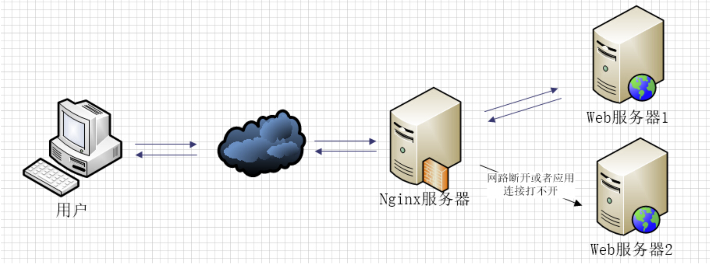

# Nginx配置详解

文章引用：[Nginx配置详解-张龙豪-博客园](https://www.cnblogs.com/knowledgesea/p/5175711.html)

## nginx文件结构

```conf
...              #全局块

events {         #events块
   ...
}

http      #http块
{
    ...   #http全局块
    server        #server块
    {
        ...       #server全局块
        location [PATTERN]   #location块
        {
            ...
        }
        location [PATTERN]
        {
            ...
        }
    }
    server
    {
      ...
    }
    ...     #http全局块
}
```

说明：

- 全局块：配置影响nginx全局的指令。一般有运行nginx服务器的用户组，nginx进程pid存放路径，日志存放路径，配置文件引入，允许生成worker process数等。
- events块：配置影响nginx服务器或与用户的网络连接。有每个进程的最大连接数，选取哪种事件驱动模型处理连接请求，是否允许同时接受多个网路连接，开启多个网络连接序列化等。
- http块：可以嵌套多个server，配置代理，缓存，日志定义等绝大多数功能和第三方模块的配置。如文件引入，mime-type定义，日志自定义，是否使用sendfile传输文件，连接超时时间，单连接请求数等。
- server块：配置虚拟主机的相关参数，一个http中可以有多个server。
- location块：配置请求的路由，以及各种页面的处理情况。

一个示例的Nginx配置文件：

```conf
########### 每个指令必须有分号结束。#################
#user administrator administrators;  #配置用户或者组，默认为nobody nobody。
#worker_processes 2;  #允许生成的进程数，默认为1
#pid /nginx/pid/nginx.pid;   #指定nginx进程运行文件存放地址
error_log log/error.log debug;  #制定日志路径，级别。这个设置可以放入全局块，http块，server块，级别以此为：debug|info|notice|warn|error|crit|alert|emerg
events {
    accept_mutex on;   #设置网路连接序列化，防止惊群现象发生，默认为on
    multi_accept on;  #设置一个进程是否同时接受多个网络连接，默认为off
    #use epoll;      #事件驱动模型，select|poll|kqueue|epoll|resig|/dev/poll|eventport
    worker_connections  1024;    #最大连接数，默认为512
}
http {
    include       mime.types;   #文件扩展名与文件类型映射表
    default_type  application/octet-stream; #默认文件类型，默认为text/plain
    #access_log off; #取消服务日志
    log_format myFormat '$remote_addr–$remote_user [$time_local] $request $status $body_bytes_sent $http_referer $http_user_agent $http_x_forwarded_for'; #自定义格式
    access_log log/access.log myFormat;  #combined为日志格式的默认值
    sendfile on;   #允许sendfile方式传输文件，默认为off，可以在http块，server块，location块。
    sendfile_max_chunk 100k;  #每个进程每次调用传输数量不能大于设定的值，默认为0，即不设上限。
    keepalive_timeout 65;  #连接超时时间，默认为75s，可以在http，server，location块。

    upstream mysvr {
      server 127.0.0.1:7878;
      server 192.168.10.121:3333 backup;  #热备
    }

    error_page 404 https://www.baidu.com; #错误页

    server {
        keepalive_requests 120; #单连接请求上限次数。
        listen       4545;   #监听端口
        server_name  127.0.0.1;   #监听地址
        location  ~*^.+$ {       #请求的url过滤，正则匹配，~为区分大小写，~*为不区分大小写。
           #root path;  #根目录
           #index vv.txt;  #设置默认页
           proxy_pass  http://mysvr;  #请求转向mysvr 定义的服务器列表
           deny 127.0.0.1;  #拒绝的ip
           allow 172.18.5.54; #允许的ip
        }
    }
}
```

额外说明：

1. 格式说明
   1. $remote_addr：与$http_x_forwarded_for 用以记录客户端的ip地址；
   2. $remote_user：用来记录客户端用户名称；
   3. $time_local：用来记录访问时间与时区；
   4. $request：用来记录请求的url与http协议；
   5. $status：用来记录请求状态，成功是200；
   6. $body_bytes_sent：记录发送给客户端文件主体内容大小；
   7. $http_referer：用来记录从那个页面链接访问过来的；
   8. $http_user_agent：记录客户端浏览器的相关信息；
2. 惊群现象：一个网路连接到来，多个睡眠的进程被同事叫醒，但只有一个进程能获得链接，这样会影响系统性能。
3. 每个指令必须有分号结束。

## Nginx代理服务的配置说明

### 错误页配置

在http模块中，当代理遇到状态码为404时，把404页面导向百度。

```conf
error_page 404 https://www.baidu.com; #错误页
```

然而这个配置，并没有起作用。如果让它起作用，必须配合着下面的配置一起使用：

```conf
proxy_intercept_errors on;    #如果被代理服务器返回的状态码为400或者大于400，设置的error_page配置起作用。默认为off。
```

### 设置代理只允许接受get，post请求方法的一种

```conf
proxy_method get;    #支持客户端的请求方法。post/get；
```

### 设置支持的http协议版本

```conf
proxy_http_version 1.0 ; #Nginx服务器提供代理服务的http协议版本1.0，1.1，默认设置为1.0版本
```

### 避免响应连接时间过长，导致客户端的页面一直在等待响应

如果你的nginx服务器给2台web服务器做代理，负载均衡算法采用轮询，那么当你的一台机器web程序iis关闭，也就是说web不能访问，那么nginx服务器分发请求还是会给这台不能访问的web服务器。

如果这里的响应连接时间过长，就会导致客户端的页面一直在等待响应，对用户来说体验就打打折扣，这里我们怎么避免这样的情况发生呢。

这里配张图来说明下问题。



如果负载均衡中其中web2发生这样的情况，nginx首先会去web1请求，但是nginx在配置不当的情况下会继续分发请求道web2，然后等待web2响应，直到我们的响应时间超时，才会把请求重新分发给web1，这里的响应时间如果过长，用户等待的时间就会越长。

下面的配置是解决方案之一。

```conf
proxy_connect_timeout 1;   #nginx服务器与被代理的服务器建立连接的超时时间，默认60秒
proxy_read_timeout 1; #nginx服务器想被代理服务器组发出read请求后，等待响应的超时间，默认为60秒。
proxy_send_timeout 1; #nginx服务器想被代理服务器组发出write请求后，等待响应的超时间，默认为60秒。
proxy_ignore_client_abort on;  #客户端断网时，nginx服务器是否终端对被代理服务器的请求。默认为off。
```

### 反向代理upstream中设置的服务器组，出现故障时，将请求顺次交由下一组服务器处理

如果使用upstream指令配置啦一组服务器作为被代理服务器，服务器中的访问算法遵循配置的负载均衡规则，同时可以使用该指令配置在发生哪些异常情况时，将请求顺次交由下一组服务器处理。

```conf
proxy_next_upstream timeout;  #反向代理upstream中设置的服务器组，出现故障时，被代理服务器返回的状态值。error|timeout|invalid_header|http_500|http_502|http_503|http_504|http_404|off
```

- error：建立连接或向被代理的服务器发送请求或读取响应信息时服务器发生错误。
- timeout：建立连接，想被代理服务器发送请求或读取响应信息时服务器发生超时。
- invalid_header：被代理服务器返回的响应头异常。
- off：无法将请求分发给被代理的服务器。
- http_400，....：被代理服务器返回的状态码为400，500，502，等。

### 通过http获取客户的ip是真实ip而不是获取代理服务器的ip地址

如下设置：

```conf
proxy_set_header Host $host; #只要用户在浏览器中访问的域名绑定了VIP，VIP下面有RS，则就用$host；host是访问URL中的域名和端口，如：www.taobao.com:80
proxy_set_header X-Real-IP $remote_addr;  #把源IP【$remote_addr,建立HTTP连接header里面的信息】赋值给X-Real-IP；这样在代码中 $X-Real-IP来获取源IP
proxy_set_header X-Forwarded-For $proxy_add_x_forwarded_for;#在nginx作为代理服务器时，设置的IP列表，会把经过的机器ip，代理机器ip都记录下来，用【，】隔开；代码中用 echo $x-forwarded-for |awk -F, '{print $1}' 来作为源IP
```

## 代理配置参考

```conf
    include       mime.types;   #文件扩展名与文件类型映射表
    default_type  application/octet-stream; #默认文件类型，默认为text/plain
    #access_log off; #取消服务日志
    log_format myFormat ' $remote_addr–$remote_user [$time_local] $request $status $body_bytes_sent $http_referer $http_user_agent $http_x_forwarded_for'; #自定义格式
    access_log log/access.log myFormat;  #combined为日志格式的默认值
    sendfile on;   #允许sendfile方式传输文件，默认为off，可以在http块，server块，location块。
    sendfile_max_chunk 100k;  #每个进程每次调用传输数量不能大于设定的值，默认为0，即不设上限。
    keepalive_timeout 65;  #连接超时时间，默认为75s，可以在http，server，location块。
    proxy_connect_timeout 1;   #nginx服务器与被代理的服务器建立连接的超时时间，默认60秒
    proxy_read_timeout 1; #nginx服务器想被代理服务器组发出read请求后，等待响应的超时间，默认为60秒。
    proxy_send_timeout 1; #nginx服务器想被代理服务器组发出write请求后，等待响应的超时间，默认为60秒。
    proxy_http_version 1.0 ; #Nginx服务器提供代理服务的http协议版本1.0，1.1，默认设置为1.0版本。
    #proxy_method get;    #支持客户端的请求方法。post/get；
    proxy_ignore_client_abort on;  #客户端断网时，nginx服务器是否终端对被代理服务器的请求。默认为off。
    proxy_ignore_headers "Expires" "Set-Cookie";  #Nginx服务器不处理设置的http相应投中的头域，这里空格隔开可以设置多个。
    proxy_intercept_errors on;    #如果被代理服务器返回的状态码为400或者大于400，设置的error_page配置起作用。默认为off。
    proxy_headers_hash_max_size 1024; #存放http报文头的哈希表容量上限，默认为512个字符。
    proxy_headers_hash_bucket_size 128; #nginx服务器申请存放http报文头的哈希表容量大小。默认为64个字符。
    proxy_next_upstream timeout;  #反向代理upstream中设置的服务器组，出现故障时，被代理服务器返回的状态值。error|timeout|invalid_header|http_500|http_502|http_503|http_504|http_404|off
    #proxy_ssl_session_reuse on; 默认为on，如果我们在错误日志中发现“SSL3_GET_FINSHED:digest check failed”的情况时，可以将该指令设置为off。
```
